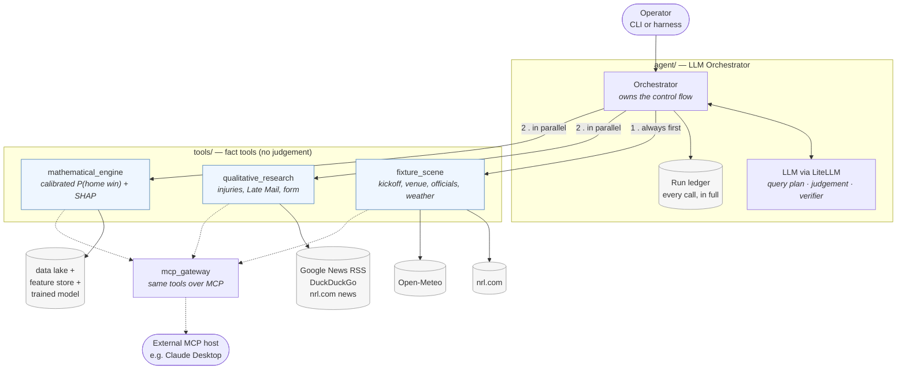
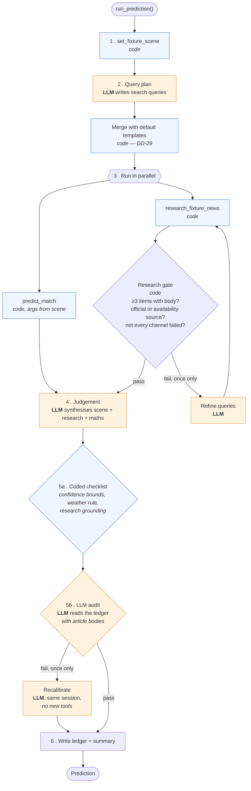
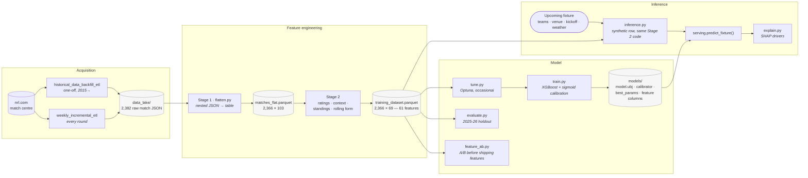

# System architecture

Three views of the same system: what the components are, how a prediction is
made, and how data moves from nrl.com to a trained model.

Component-level detail lives beside the code:
[`agent/Architecture.md`](agent/Architecture.md) ·
[`tools/mathematical_engine/Overview.md`](tools/mathematical_engine/Overview.md) ·
[`tools/qualitative_research/Architecture.md`](tools/qualitative_research/Architecture.md) ·
[`tools/fixture_scene/Architecture.md`](tools/fixture_scene/Architecture.md) ·
[`tools/mcp_gateway/Architecture.md`](tools/mcp_gateway/Architecture.md)

---

## 1. System view

Three fact tools, one agent. The tools return evidence and never pick a winner;
the agent is the only component allowed to form a judgement.



The scene tool runs first and unconditionally, because its output supplies the
arguments for the other two: the venue, kickoff and weather label handed to
`predict_match` come from the scene rather than from the LLM
([ADR 0005](agent/adrs/0005-scene-wires-predict.md)). That is what stops the
model being asked to predict a match at a venue the LLM invented.

---

## 2. Agent control loop

The code decides which tool runs and when. The LLM contributes judgement at
three fixed points and never chooses a tool
([ADR 0001](agent/adrs/0001-agent-control-loop.md)).



Both loops are capped at one iteration. Two things are worth noticing:

- **The gate is code, not the LLM.** Whether research is good enough is decided
  by counting items and checking sources, so it cannot be talked around.
- **The checklist runs before the LLM audit.** Anything decidable from the
  ledger — confidence within 0.10 of the model probability, no weather claim
  without a weather SHAP driver, at least one research-sourced factor — is
  checked in code, because the verifier LLM is exactly as fallible as the judge
  ([ADR 0006](agent/adrs/0006-grounded-judgement-and-confidence.md),
  [ADR 0008](agent/adrs/0008-verifier-sees-the-evidence.md)).

---

## 3. Data flow: nrl.com to a trained model



Two properties this shape is designed to guarantee:

- **No leakage.** Every feature attached to a match is computed only from
  matches that kicked off earlier. Ratings, ladder position and rolling form are
  all built by walking the table in chronological order, and the holdout seasons
  (2025–2026) are never touched during tuning or training.
- **No train/serve skew.** The inference path appends a synthetic row for the
  upcoming fixture and runs *the same Stage 2 functions* over it. A parity test
  checks that features built this way for a historical match equal the ones the
  model trained on.

---

## 4. Where results land

```
agent_runs/
├── fixtures/2026-R23_Titans-v-Cowboys/20260803T093203Z/
│   ├── ledger.json      complete record — every tool request and response
│   └── summary.md       the same run, readable
└── rounds/2026-R23/
    ├── predictions.json written BEFORE kickoff
    ├── scored.json      written AFTER the games, by a separate command
    └── summary.md       the scorecard
```

See [`agent_runs/README.md`](agent_runs/README.md) for how to read a ledger.
