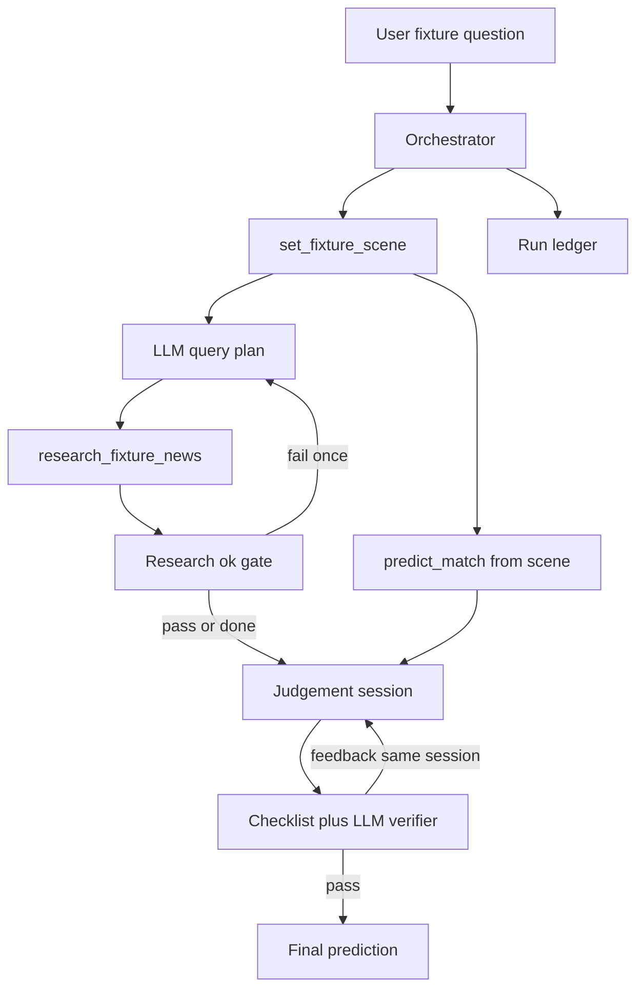

# Agent Architecture

Constrained fact acquisition + LLM judgement + bounded loops. Fact tools use
the **same library entrypoints** as [`tools/mcp_gateway/`](../tools/mcp_gateway/)
(in-process from this package for reliability; MCP remains the host-facing
surface for other clients).

See ADRs in [`adrs/`](adrs/).

## Control flow



## Agency

| Layer | Owner |
| --- | --- |
| Tool order | Code |
| Research queries + ≤1 refine | LLM + coverage gate |
| predict args (venue/kickoff/weather) | Code from scene |
| Judgement | LLM session (non-agentic synthesis), bounded by the confidence policy below |
| Verifier | Checklist + LLM audit; ≤1 recalibrate **without tools** |

The LLM's research queries are merged with the tool's default templates rather
than replacing them, so a weak query plan cannot disable the availability
coverage the gate depends on (DD-29).

## Research ok gate

```text
kept_items_with_body >= 3
AND (official/nrl_news OR availability keywords)
AND NOT all wide-net channels failed empty
```

## Judgement grounding

Rules stated in the prompt, with coded enforcement only where the ledger makes
the answer structural rather than semantic (ADR 0006):

- At least one key factor must come from research whenever research returned
  usable items — enforced in the checklist.
- Weather is not a valid key factor unless a weather feature appears in the
  SHAP drivers — prompt + LLM audit `weather_not_headline` only. A coded
  keyword scan once flagged "hamstring strain" as weather (`rain` ⊂ `strain`)
  and triggered a useless recalibration; the audit had already passed correctly.

Research-use violations become checklist issues and feed the recalibration loop.
Weather violations do the same, but only when the audit fails them.

## Confidence

The judge's confidence is its own number. Nothing compares it to the model
probability, because a prediction's Brier score is a function of its probability:
tie the two and the agent's Brier score becomes a restatement of the model's, so
the comparative evaluation cannot distinguish them however the system performs
(ADR 0009).

Overconfidence is handled in the prompt — the number is framed as a frequency
claim, given explicit bands, and preceded by naming the strongest reason the pick
could lose. Two bounds are enforced in code, neither derived from the model: a
floor of 0.50, below which the judge has contradicted its own `winner` and the
conversion to P(home win) would score it as a pick for the other side, and a
ceiling of 0.95 as a backstop.

The model probability travels beside the agent's confidence in `record.json` and
`predictions_log.csv`, so the two are scored independently and the gap between
them is itself an observation.

## What the verifier can see

The LLM audit runs on an abridged ledger, but the abridgement must still carry
the evidence the audit is asked about: research items are passed with their body
excerpts (12 items × 900 chars), because player names and injuries live in
article bodies, not headlines. Shown titles alone, the verifier declared a
correctly sourced injury list a hallucination and the recalibration loop deleted
a true fact (ADR 0008). Before trusting an LLM check, confirm the evidence it
needs is in its context.

## Ledger

Every run writes `ledger.json` — request, tool_calls, agent_steps,
research_loop, verifier_loop, final_judgement — plus a rendered `summary.md`,
under `agent_runs/fixtures/<fixture>/<timestamp>/`. The ledger leads with a
derived `at_a_glance` block and orders its keys summary-first; nothing is ever
removed from it, so any figure in a summary traces back to the tool response
that produced it. Layout: [`agent_runs/README.md`](../agent_runs/README.md).

## Measuring the agent

`agent_app.harness` runs a whole round and scores it against actuals once the
games are played (ADR 0007). Predictions are written before kickoff and scored
by a separate command, so results cannot be back-fitted.

```bash
uv run python -m agent_app.harness run   --season 2026 --round 23
uv run python -m agent_app.harness score --season 2026 --round 23
```
