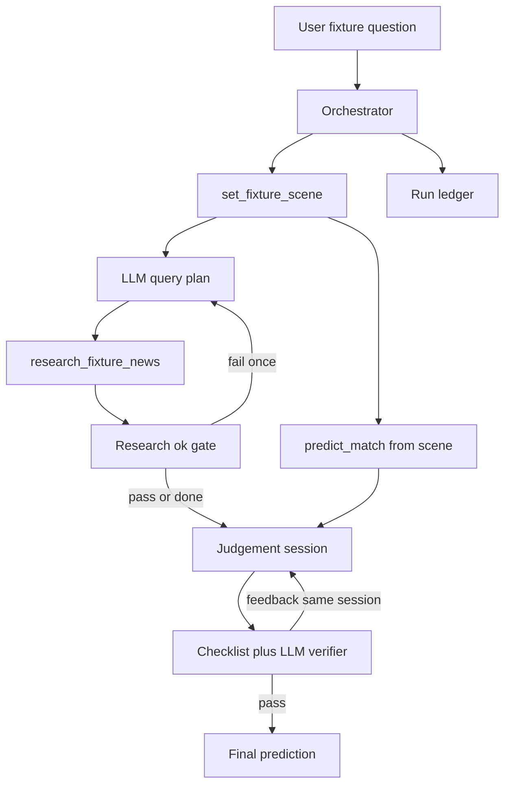

# Agent Architecture

Constrained fact acquisition + LLM judgement + bounded loops. Fact tools use
the **same library entrypoints** as [`tools/mcp_gateway/`](../tools/mcp_gateway/)
(in-process from this package for reliability; MCP remains the host-facing
surface for other clients).

See ADRs in [`adrs/`](adrs/).

## Control flow



## Agency

| Layer | Owner |
| --- | --- |
| Tool order | Code |
| Research queries + ≤1 refine | LLM + coverage gate |
| predict args (venue/kickoff/weather) | Code from scene |
| Judgement | LLM session (non-agentic synthesis) |
| Verifier | Checklist + LLM audit; ≤1 recalibrate **without tools** |

## Research ok gate

```text
kept_items_with_body >= 3
AND (official/nrl_news OR availability keywords)
AND NOT all wide-net channels failed empty
```

## Ledger

Every run writes `agent_runs/<run_id>/ledger.json`: request, tool_calls,
agent_steps, research_loop, verifier_loop, final_judgement.
