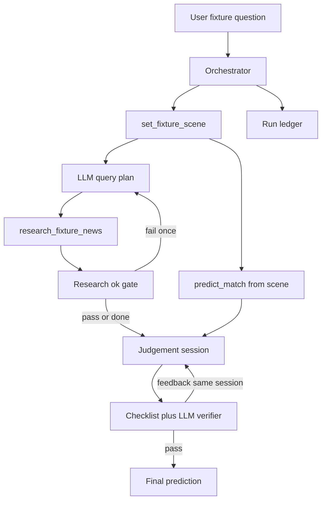

# Agent Architecture

Constrained fact acquisition + LLM judgement + bounded loops. Fact tools use
the **same library entrypoints** as [`tools/mcp_gateway/`](../tools/mcp_gateway/)
(in-process from this package for reliability; MCP remains the host-facing
surface for other clients).

See ADRs in [`adrs/`](adrs/).

## Control flow



## Agency

| Layer | Owner |
| --- | --- |
| Tool order | Code |
| Research queries + ≤1 refine | LLM + coverage gate |
| predict args (venue/kickoff/weather) | Code from scene |
| Judgement | LLM session (non-agentic synthesis), bounded by the confidence policy below |
| Verifier | Checklist + LLM audit; ≤1 recalibrate **without tools** |

The LLM's research queries are merged with the tool's default templates rather
than replacing them, so a weak query plan cannot disable the availability
coverage the gate depends on (DD-29).

## Research ok gate

```text
kept_items_with_body >= 3
AND (official/nrl_news OR availability keywords)
AND NOT all wide-net channels failed empty
```

## Judgement grounding and confidence

Three rules, stated in the prompt and enforced deterministically in
`verifier.py` because the verifier LLM is as fallible as the judge
(ADR 0006):

- Weather is not a valid key factor unless a weather feature appears in the
  SHAP drivers the math tool returned.
- At least one key factor must come from research whenever research returned
  usable items.
- Confidence sits within 0.10 of the model probability for the picked side,
  never above 0.85, and never above 0.60 when picking against the model.

Violations become checklist issues and feed the recalibration loop.

## What the verifier can see

The LLM audit runs on an abridged ledger, but the abridgement must still carry
the evidence the audit is asked about: research items are passed with their body
excerpts (12 items × 900 chars), because player names and injuries live in
article bodies, not headlines. Shown titles alone, the verifier declared a
correctly sourced injury list a hallucination and the recalibration loop deleted
a true fact (ADR 0008). Before trusting an LLM check, confirm the evidence it
needs is in its context.

## Ledger

Every run writes `ledger.json` — request, tool_calls, agent_steps,
research_loop, verifier_loop, final_judgement — plus a rendered `summary.md`,
under `agent_runs/fixtures/<fixture>/<timestamp>/`. The ledger leads with a
derived `at_a_glance` block and orders its keys summary-first; nothing is ever
removed from it, so any figure in a summary traces back to the tool response
that produced it. Layout: [`agent_runs/README.md`](../agent_runs/README.md).

## Measuring the agent

`agent_app.harness` runs a whole round and scores it against actuals once the
games are played (ADR 0007). Predictions are written before kickoff and scored
by a separate command, so results cannot be back-fitted.

```bash
uv run python -m agent_app.harness run   --season 2026 --round 23
uv run python -m agent_app.harness score --season 2026 --round 23
```
