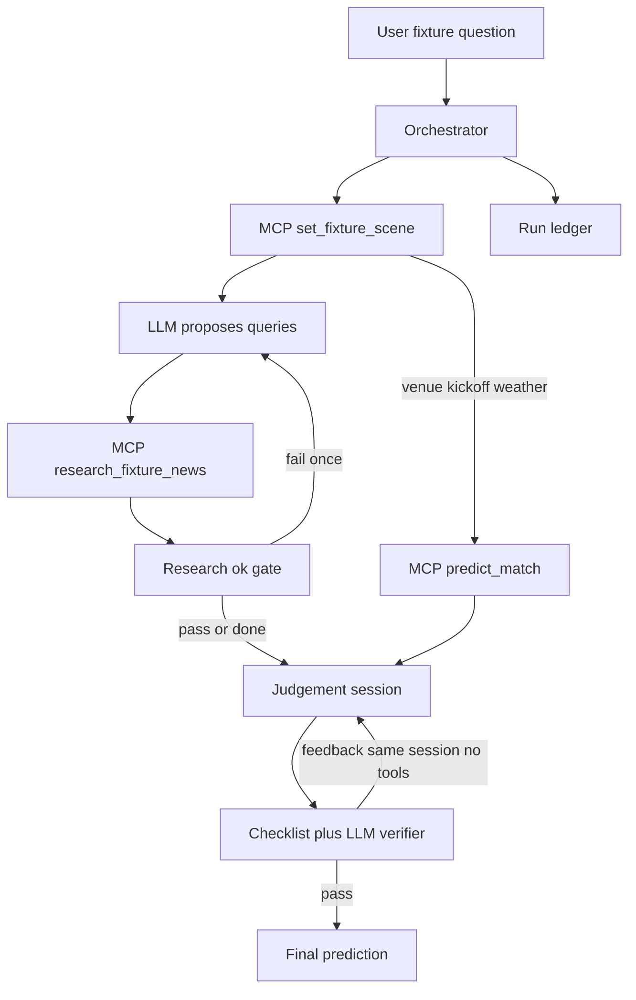

# Agent Architecture Bake-off (ADR-ready)

## What is an ADR?

Short markdown design note: decision, alternatives, why, rejected options. Numbered `adrs/0001-….md` for the Capstone report.

---

## Locked decisions (signed off)

- Fact tools via [`tools/mcp_gateway/`](tools/mcp_gateway/)
- **Scene first**; research must not re-search weather / venue / officials / kickoff
- **Primary agency:** LLM authors research **queries** (optional list on the research tool)
- **Research refine loop (≤1):** coded gate on research quality → if fail, LLM proposes refined queries → one re-call of research only; then continue even if still weak
- **`predict_match`:** unchanged signature; orchestrator **code** fills venue/kickoff/`weather=math_weather_label` from scene
- **Judgement:** LLM synthesis over fixed evidence (not tool-calling agency)
- **Verifier loop (≤1):** checklist **plus** LLM audit subagent; on fail, send a **short feedback instruction** into the **same orchestrator/judgement chat session** so it recalibrates the prediction — **no new tool calls**
- Research loop and verifier loop are **independent** (each 0 or 1 per run)
- **Ledger = full observability** (every tool call, query plan, loop trigger/reason, judgements before/after, verifier output)
- CLIs for humans; no per-tool FastAPI
- **LLM configurable:** Ollama (dev) → OpenAI / Anthropic / Gemini / Bedrock (eval)

---

## Two loops (explicit)

### Loop A — Research refine (may re-call research tool only)

```text
research_ok =
  (kept_items_with_body >= 3)
  AND (has_official_or_nrl_news OR has_availability_keyword_hit)
  AND (not every_wide_net_channel_failed_with_zero_items)
```

Availability keywords: injury / late mail / team list / casualty / suspension (etc.).  
**Not** betting-source dependent.

If `not research_ok` and loop unused → refine queries (fewer/sharper) → research once more. Ledger `research_loop`.

### Loop B — Verifier recalibrate (NO new tool calls)

1. After first judgement, build/update ledger.  
2. **Checklist (code):** required tools present; predict args from scene; structured judgement fields; citations refer to ledger evidence where checkable.  
3. **LLM verifier subagent (read-only on ledger):** catch reasoning errors / overweights / hallucinations (e.g. treat venue as decisive when SHAP says nearly irrelevant).  
4. If either layer fails and verifier loop unused → append a **short structured instruction** to the **same judgement session** (retain prior reasoning context).  
5. Orchestrator **re-thinks and re-outputs** refined prediction (may agree or disagree with feedback).  
6. **Does not** re-run scene, research, or math.

Example (user-aligned): verifier notes Melbourne location overweighted vs SHAP → instructs “reconsider location weight” → same session produces refined pick/confidence/cites.

Ledger `verifier_loop`: checklist, audit JSON, instruction, judgement_before, judgement_after.

---

## Options considered

- Free ReAct — discard as primary control  
- Pure non-LLM product — discard  
- Multi-process multi-agent tool users — discard  
- Verifier that re-runs the full pipeline / tools — **discard** (recalibrate judgement only)  
- LLM overrides math weather/features — discard  
- **Chosen:** constrained fact pipeline + agent queries + research refine ≤1 + simple judgement + verifier audit ≤1 in-session



### Concrete happy path

1. Scene  
2. LLM query plan → research (optional one refine if gate fails)  
3. Predict from scene (parallel with research after scene OK)  
4. Judgement in a retained chat session  
5. Verifier; optional one in-session recalibrate  
6. Final prediction + complete ledger  

### Research tool change

- Optional `queries: list[str] | None` on assemble + MCP  
- Omit → default templates (CLI); provide → agent list (cap ~6)  

### Math tool

- No signature change; scene wiring in orchestrator only  

---

## Agency summary

| Layer | Owner | Agency / loops |
| --- | --- | --- |
| Tool order | Code | None |
| Research queries + ≤1 refine | LLM + coded gate | Primary |
| predict args | Code from scene | None |
| Judgement | LLM session | Non-agentic synthesis |
| Verifier | Checklist + LLM audit | Feedback only; ≤1 recalibrate, **no tools** |

**Package:** `agent/` at repo root (sibling to `tools/`).

## LLM config

- LiteLLM; `ollama` \| `openai` \| `anthropic` \| `gemini` \| `bedrock`  
- Flags: `VERIFIER_ENABLED`, `MAX_RESEARCH_LOOPS=1`, `MAX_VERIFIER_LOOPS=1`, `MAX_AGENT_QUERIES=6`

## Implementation order (after execute)

1. ADRs  
2. Research + MCP `queries`  
3. MCP docstring polish  
4. Scaffold `agent/` + Ollama smoke  
5. Orchestrator + research gate/loop + ledger  
6. Judgement session + verifier (checklist + audit) + in-session recalibrate  
7. Docs  

**Out of scope for first slice:** Docker, OpenTelemetry, full eval harness, math counterfactuals, verifier-triggered tool recalls.
