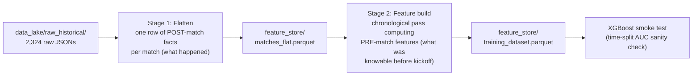

# Phase 2: Feature Engineering & Training Dataset

## Goal

Transform `data_lake/raw_historical/` (2,324 raw match JSONs) into a model-ready Parquet training dataset implementing all five feature pillars from [mathematical_engine/Overview.md](mathematical_engine/Overview.md), respecting the constraints in [mathematical_engine/Data_Quality_Findings.md](mathematical_engine/Data_Quality_Findings.md).

## Architecture: two-stage pipeline

The cardinal rule is **no leakage**: every feature for match N may only use information available before kickoff of match N. This forces a two-stage design.



- **Stage 1 (flatten)** parses each raw JSON into one flat row of that match's facts: scores, team stats from `stats.groups`, timeline aggregates (last-20-min net points, penalty gap times, first scorer), player workload aggregates (top-3 share of run metres / tackles), metadata (startTime, venue, weather, teams), and the `ctx_travel_away` flag. Independent per file, fast to re-run.

### Stage 1 guardrails (agreed)

1. **Venue-to-state dictionary**: a hardcoded dict at the top of `flatten.py` maps NRL venue names to states (NSW, QLD, VIC, ACT, WA, SA, NT, NZ, USA, UK), covering legacy names (ANZ vs Accor Stadium, 1300SMILES, etc.). `ctx_travel_away` = 1 when the venue state differs from the away team's home state. Unknown venues default the flag to 0 and print a warning listing the venue name so the dict can be extended.
2. **Strictly binary outcomes**: matches where home score == away score (draws) are dropped before writing the Parquet, alongside the 4 phantom COVID games.
3. **The NaN rule**: era-missing telemetry (e.g. Completion Rate pre-2019) is never imputed or guessed — left as NaN for XGBoost's native missing-value handling. (The one permitted derivation: 2015 team errors are summed exactly from per-player `errors` in the raw payload — aggregation of real data, not imputation.)
- **Stage 2 (feature build)** sorts matches chronologically and computes rolling/cumulative pre-match features, joining each match's features to its label (home win).

The weekly incremental pipeline (Job B, later) reuses Stage 1 unchanged and re-runs Stage 2.

## New structure

```
mathematical_engine/
  feature_engineering/
    __init__.py
    flatten.py            # Stage 1: raw JSON -> flat facts row (incl. timeline, workload, travel flag)
    ratings.py            # Elo w/ off-season mean reversion, Pythagorean, Bradley-Terry
    context.py            # rest days, venue HGA, weather category
    rolling_form.py       # rolling 3/5-game telemetry, momentum, workload averages
    build_dataset.py      # CLI orchestrator: stage 1 + stage 2 -> feature_store/
    smoke_test.py         # quick XGBoost validation (not Phase 3 training)
  feature_store/          # transformed Parquet output (add to .gitignore)
  Feature_Dictionary.md   # documents every feature: definition, window, era availability
```

Deps added to [mathematical_engine/pyproject.toml](mathematical_engine/pyproject.toml): `pandas`, `pyarrow`, `xgboost`, `scikit-learn`.

## Feature set (one row per match, home-vs-away differentials)

Names use family prefixes so SHAP output reads cleanly (e.g. `form5_post_contact_metres_diff`, `elo_diff`).

**A. Power ratings** (cumulative from 2015 round 1)
- `elo_diff`: rolling Elo, K=32, regressed 30% to league mean at each season boundary.
- `pythag10_diff`: Pythagorean expected win % over each team's last 10 games (exponent ~2.5, configurable).
- `bt_diff`: Bradley-Terry strength fit on all prior matches with exponential time decay, refit per round.

**B. Environmental context**
- `ctx_venue_hga`: smoothed historical home-win rate at the venue (cumulative, pre-match only).
- `ctx_rest_days_home/away/diff`: days since each team's previous match (from `startTime`).
- `ctx_travel_away`: flag from the hardcoded venue-name-to-state mapping (incl. NZ, Las Vegas, legacy names) vs the away team's home state; computed in Stage 1.
- `ctx_weather`: categorical Fine/Rain/etc. with explicit Unknown for the ~36% missing (per your decision: no external API now).

**C. Granular telemetry form** (rolling 3- and 5-game averages, as differentials)
Post-contact metres, kick metres, possession %, completion rate (2019+ only, NaN before — XGBoost handles natively), effective tackle %, missed tackles, errors (2015 reconstructed by summing player `errors`), penalties conceded, tackle breaks, offloads, all-run metres, points for/against.

Explicitly required telemetry features (verified against the raw payloads):

- `form{3,5}_line_breaks_diff` — team "Line Breaks" stat from the Attack group. Available all seasons.
- `form{3,5}_forced_drop_outs_diff` — team "Forced Drop Outs" stat from the Kicking group. Present in ~90% of matches every season; missing stays NaN (NaN rule).
- `form{3,5}_play_the_ball_speed_diff` — team "Average Play The Ball Speed" stat from the Attack group. Confirmed present in all seasons.
- `form{3,5}_decoy_runs_diff` — **proxy**: `decoyRuns` does not exist anywhere in the NRL payload (neither team groups nor the 59 player stat fields). Closest real field is per-player `lineEngagedRuns` (runs that engage the defensive line without receiving), summed to team level. Documented as a proxy in the feature dictionary.
- `form{3,5}_support_plays_diff` — **proxy**: no `supports` field exists either. Support involvement is captured by summing per-player `lineBreakAssists` + `tryAssists` to team level. Documented as a proxy in the feature dictionary.

**D. Momentum and fatigue** (rolling 5-game, from timeline)
- `mom5_last20_net_points_diff`: net points in regulation gameSeconds 3600-4800.
- `mom5_penalty_gap_seconds_diff`: mean time between conceded discipline events (Penalty pre-2020; Penalty + SetRestart + RuckInfringement from 2020, kept era-consistent). Timeline `teamId` verified to mean the *conceding* team (event counts match the "Penalties Conceded" team stat exactly, 106/106 checked matches with zero mismatches).
- `mom5_penalty_cluster_rate_diff`: discipline-collapse density — per match, the number of times a team conceded 3+ discipline events within any sliding 5-minute (300s) window of the timeline; rolling 5-game average, as a differential.
- `mom5_first_to_score_rate_diff`: share of recent games where the team scored first.

**E. Roster resilience** (rolling 5-game)
- `wl5_top3_run_metre_share_diff`, `wl5_top3_tackle_share_diff`: workload concentration of each team's top 3 players (player stats verified identical across all 12 seasons).

## Data hygiene rules

- Drop the 4 phantom COVID games (empty `stats.groups`) in Stage 1.
- Label = home win; draws (~1% of games) are dropped in Stage 1 before the Parquet is written (strictly binary outcomes). Note the accepted trade-off: drawn games therefore also don't contribute to Elo/rolling-form history in Stage 2.
- Era-gated stats stay NaN rather than imputed — XGBoost handles missing values natively.
- Keep identifier columns (`match_id`, `season`, `round`, team names, `startTime`) in the Parquet for traceability but excluded from model features.
- Early-2015 rows will have NaN-heavy rolling features; keep them (configurable `--min-history` filter available).

## Validation and sign-off

1. **Leakage checks**: rolling features for a sampled match recomputed by hand from prior matches only; assert Elo at match N is unaffected by match N's result.
2. **Coverage stats**: per-season feature null rates printed by `build_dataset.py`.
3. **Smoke test** (`smoke_test.py`): chronological split (train 2015-2023, test 2024-2026), default-ish XGBoost, report AUC + accuracy vs the always-pick-home baseline (~57%). Expected AUC roughly 0.60-0.68 — confirms the dataset is learnable and not leaky (suspiciously high AUC would indicate leakage). Real tuning/calibration remains Phase 3.
4. `Feature_Dictionary.md` written for your capstone report and future SHAP narration.