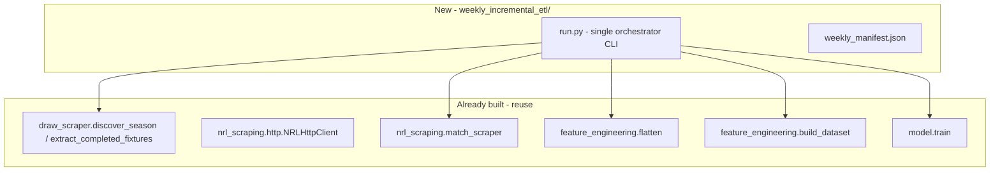

# Phase 4a: Weekly Incremental ETL (Job B)

## Goal

One command you can run after each round that:

1. Finds **newly completed** matches you don't have yet
2. Scrapes their raw JSON into the **same** `data_lake/raw_historical/` tree Job A uses
3. **Full-rebuilds** `feature_store/` (Stage 1 + Stage 2)
4. **Retrains** the production model (`model.train` → `models/`)

No hyperparameter tuning in this loop — that stays occasional (`model.tune`).

The FastAPI endpoint (Phase 4b) will **only load** whatever `models/` contains after this job runs. It never triggers this pipeline.

## Why you need this now

Your historical backfill completed **12 June 2026** with **109** raw JSON files for the 2026 season. Games have been played since. Until Job B runs, `model.predict` and (later) the API are predicting from **stale** history and a model trained on outdated rows.

**First action after building:** run a **catch-up** for season 2026 (and optionally re-scan 2025 for any late corrections — usually unnecessary).

## Relationship to existing code



| Component | Job A (backfill) | Job B (weekly) |
| --- | --- | --- |
| Directory | `historical_data_backfill_etl/` | `weekly_incremental_etl/` |
| Scope | All seasons 2015–2026, one-off | Current season (default), only **new** matches |
| Discovery | Full season enumeration | Same draw logic, scoped to `--season` |
| Raw storage | `data_lake/raw_historical/{season}/` | **Same path** — one unified lake |
| Manifest | `backfill_manifest.json` | **`weekly_manifest.json`** (don't mix) |
| Features | Manual `build_dataset` | Automated full rebuild |
| Model | Manual `model.train` | Automated at end |

**Deviation from Overview.md §3.2:** the original sketch mentioned a "static URL feed" each week. We will use **automatic draw-page discovery** (already implemented in `draw_scraper.py`) because it is more reliable, requires zero manual URL collection, and filters to `matchMode == "Post"` (completed games only).

## Key design decisions (already agreed — carry forward)

From [key_design_decisions.md](../key_design_decisions.md):

- **DD-03:** Job B is a sibling directory; shares `nrl_scraping/`, not backfill code.
- **DD-15:** **Full Parquet rebuild** each run (~25–30s for Stage 1+2 today), not append. Guarantees Elo/BT/rolling features are chronologically correct.
- **DD-19:** Weekly = `model.train` only; `model.tune` stays occasional.

## New package layout

```
mathematical_engine/
  weekly_incremental_etl/
    __init__.py
    run.py              # main orchestrator CLI
    discover.py         # thin wrapper: completed fixtures minus on-disk match IDs
    scrape.py           # scrape new matches only
    report.py           # post-run summary for the operator
  data_lake/
    raw_historical/     # unchanged layout
    manifests/
      backfill_manifest.json    # Job A only — do not modify from Job B
      weekly_manifest.json      # Job B run history + last successful state
      weekly_failures.json      # scrape failures this job
```

## Weekly pipeline steps (in order)

### Step 1 — Discover

For `--season` (default: current calendar year, e.g. 2026):

1. Call `discover_season(client, season)` from `draw_scraper.py`
2. For each completed fixture, derive `match_id` from URL (or after scrape)
3. **Skip** if `data_lake/raw_historical/{season}/nrl_match_{id}.json` already exists

Output: list of pending scrape targets (typically 0–8 per round).

### Step 2 — Scrape (incremental raw only)

For each pending match:

1. `extract_match_data(client, url)` → save JSON to the same path convention as Job A
2. Record success/failure in `weekly_manifest.json` and `weekly_failures.json` on error
3. Respect `NRLHttpClient` rate limiting (default 1 req/sec)

**Only the raw JSON layer is incremental.** We add files; we never delete historical raw data in normal operation.

### Step 3 — Full feature rebuild (DD-15)

```bash
# Equivalent to what run.py calls programmatically:
uv run python -m feature_engineering.build_dataset --reflatten
```

- `--reflatten` re-reads **all** JSON in `raw_historical/` and rewrites `matches_flat.parquet`
- Stage 2 recomputes all pre-match features → `training_dataset.parquet`
- Stateful features (Elo, BT, rolling) are correct because the full table is rebuilt in chronological order

### Step 4 — Retrain production model

```bash
# Equivalent:
uv run python -m model.train
```

- Loads existing `models/best_params.json` (no Optuna)
- Refits on the updated dataset (all seasons including new 2026 matches)
- Overwrites `models/model.ubj`, `calibrator.pkl`, `metrics.json`, etc.

**Do not run `model.tune` in this loop.**

### Step 5 — Report

Print a short operator summary:

```
Weekly ETL complete
  Season scanned:     2026
  New matches scraped: 8
  Raw JSON total:     117 (2026)
  Training rows:      2319
  Model retrained at: 2026-06-22T...
  Next step:          model.predict / API (Phase 4b)
```

Optionally write `data_lake/manifests/weekly_last_run.json` for automation/monitoring.

## CLI design

Single entry point:

```bash
cd mathematical_engine

# Default: current season, discover + scrape + rebuild + retrain
uv run python -m weekly_incremental_etl.run

# Explicit season (catch-up or late run)
uv run python -m weekly_incremental_etl.run --season 2026

# Scrape only (no rebuild/retrain) — debugging
uv run python -m weekly_incremental_etl.run --scrape-only

# Rebuild + retrain only (raw JSON already updated manually)
uv run python -m weekly_incremental_etl.run --skip-scrape

# Dry run: show what would be scraped
uv run python -m weekly_incremental_etl.run --dry-run
```

**Your weekly habit (during the season):** run the default command once after the round finishes (e.g. Monday morning). ~1–2 minutes total (scrape ~8 matches at 1 req/sec + ~30s rebuild + ~3s train).

## Catch-up run (do this first after building)

```bash
cd mathematical_engine
uv run python -m weekly_incremental_etl.run --season 2026
```

This should discover every completed 2026 match on nrl.com that is not already on disk (109 files today → likely ~8–16+ new depending on rounds played since 12 June).

After catch-up, verify:

```bash
uv run python -m model.evaluate          # optional: refreshed holdout metrics
uv run python -m model.predict --home ... --away ... --venue ... --date ...
```

## What Job B does NOT do

| Out of scope | Why |
| --- | --- |
| Hyperparameter tuning | DD-19 — occasional manual `model.tune` |
| Serve HTTP predictions | Phase 4b FastAPI |
| Scrape upcoming fixtures | Only `matchMode == "Post"` (completed) |
| Modify Job A manifest | Separate weekly manifest avoids corrupting backfill state |
| Impute missing telemetry | NaN rule unchanged |
| Call the LLM / Agent | Upstream consumer only |

## Success criteria

- [ ] One command updates raw lake → feature store → `models/` end-to-end
- [ ] Idempotent: re-running with no new matches completes quickly (0 scrapes, rebuild + retrain still OK)
- [ ] Catch-up adds all 2026 matches played since June backfill
- [ ] `metrics.json` shows increased `n_training_rows` after catch-up
- [ ] `model.predict` reflects latest team form (e.g. Elo/rest days change after new results)
- [ ] Documented in README with a one-paragraph operator runbook

## Scheduling (optional — not required for capstone)

Manual weekly run is fine. If you want automation on macOS:

```bash
# Example: Mondays 6am, log to file (adjust path)
0 6 * * 1 cd /path/to/mathematical_engine && uv run python -m weekly_incremental_etl.run >> data_lake/manifests/weekly_cron.log 2>&1
```

Cron is optional; the capstone deliverable is the **script**, not hosted scheduling.

## Phase 4b preview (endpoint — plan separately)

After Job B is stable:

- FastAPI app loads `models/` at startup (or lazy on first request)
- `POST /predict` with `{home, away, venue, kickoff, weather?}` → same JSON as `model.predict`
- Health check: `GET /health` reports `metrics.json` `trained_at` and row count
- **No** scrape/retrain endpoint — operator runs Job B separately

We will plan 4b in detail once you are happy with the weekly ETL design.

## Q&A (for your report)

**Q: Why full rebuild instead of appending Parquet rows?**  
A: DD-15. Elo, Bradley-Terry, and rolling features depend on the entire chronological history. A full rebuild from raw JSON is ~30s and guarantees correctness. Appending rows without recomputing stateful features would leak or stale ratings.

**Q: Does weekly ETL re-tune hyperparameters?**  
A: No. It only runs `model.train` with saved `best_params.json`.

**Q: Where does new raw data live?**  
A: Same `data_lake/raw_historical/{season}/nrl_match_{id}.json` as Job A. One lake, two ingestion jobs.

**Q: What if a scrape fails mid-run?**  
A: Log to `weekly_failures.json`, continue other matches, still rebuild/retrain on whatever was successfully scraped (or `--skip-scrape` after fixing). Re-run is idempotent for already-downloaded match IDs.
