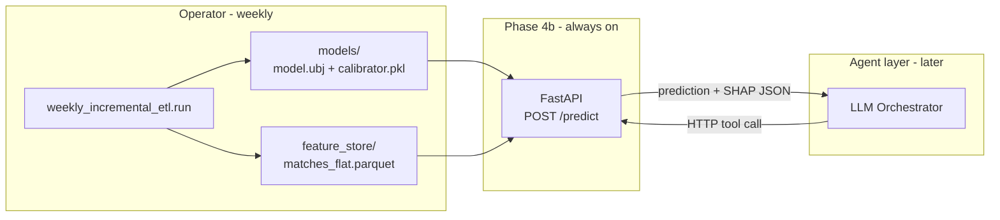

# Phase 4b: FastAPI Prediction Endpoint

## Goal

Wrap the existing prediction pipeline (`inference.py` + `model.ubj` +
`explain.py`) behind a FastAPI HTTP endpoint so the LLM Orchestrator can
call it as a tool. The endpoint:

- **Loads** trained artifacts from `models/`
- **Accepts** a fixture (home, away, venue, kickoff, optional weather)
- **Returns** the same JSON payload as `model.predict` CLI

It does **not** scrape data, rebuild features, or retrain. That remains the
weekly ETL operator's job (Phase 4a).

## How it fits the system



**Critical rule (already agreed):** the API and the weekly ETL never call
each other. Their only link is the shared `models/` directory and
`feature_store/matches_flat.parquet` (used by `inference.py`).

## New structure

```
mathematical_engine/
  api/
    __init__.py
    main.py           # FastAPI app + lifespan
    routes.py         # /predict, /health
    schemas.py        # Pydantic request/response models
  model/
    serving.py        # NEW: shared load_artifacts + predict_fixture()
    predict.py        # CLI — thin wrapper around serving.py
```

New deps in `pyproject.toml`: `fastapi`, `uvicorn[standard]`.

## Endpoints

### `POST /predict` — the tool the LLM calls

**Request body:**

```json
{
  "home_team": "Broncos",
  "away_team": "Storm",
  "venue": "Suncorp Stadium",
  "kickoff": "2026-07-04T09:30:00Z",
  "weather": "Fine"
}
```

| Field | Required | Notes |
| --- | --- | --- |
| `home_team` | Yes | NRL nickname, e.g. `Broncos` |
| `away_team` | Yes | NRL nickname, e.g. `Storm` |
| `venue` | Yes | Must match `VENUE_TO_STATE` keys |
| `kickoff` | Yes | ISO 8601 datetime |
| `weather` | No | `Fine`, `Rain`, etc. Omit → `unknown` |
| `top_k` | No | SHAP drivers per direction (default 5) |

**Response body:** identical to `model.predict` CLI output (Overview contract):

```json
{
  "prediction": "Away Win",
  "probability": 0.5481,
  "home_win_probability": 0.4519,
  "shap_explanations": {
    "positive_drivers": ["..."],
    "negative_drivers": ["..."]
  },
  "fixture": {
    "home_team": "Broncos",
    "away_team": "Storm",
    "venue": "Suncorp Stadium",
    "kickoff": "2026-07-04T09:30:00Z",
    "weather": "unknown"
  }
}
```

**Error responses:**

| Status | When |
| --- | --- |
| `404` | No trained model in `models/` (weekly ETL never run) |
| `422` | Unknown team name, bad datetime, validation failure |
| `500` | Unexpected inference/model error |

### `GET /health` — liveness + model freshness

Returns whether the server is up and which model it would serve:

```json
{
  "status": "ok",
  "model_loaded": true,
  "trained_at": "2026-07-02T05:22:13Z",
  "n_training_rows": 2330,
  "training_seasons": [2015, 2026]
}
```

Useful for the operator to confirm the API is serving the latest model
after a weekly ETL run.

## Key design decisions

### 1. Refactor, don't duplicate

Extract `load_artifacts()` and a `predict_fixture(...)` function from
`predict.py` into `model/serving.py`. Both the CLI and the API call the
same code path — no train/serve drift at the HTTP layer either.

### 2. Auto-reload artifacts after weekly ETL

**Problem:** if the model is loaded once at server startup, a weekly ETL
run replaces `models/model.ubj` on disk but the running server still holds
the old model in memory.

**Solution:** keep a singleton `ModelBundle` that checks
`models/metrics.json` modification time before each `/predict` call. If the
file is newer than the last load, reload artifacts automatically. The
operator does not need to restart the server after weekly ETL.

Cost: one `stat()` per request + occasional reload (~1s). Negligible for a
capstone agent calling the tool a few times per session.

### 3. No authentication (for now)

Local development / capstone demo. The server binds to `127.0.0.1` by
default. Document that production deployment would need an API key or
network isolation — out of scope for the capstone MVP.

### 4. CORS enabled for local agent dev

If the LLM Orchestrator runs in a separate local process or browser-based
UI, enable permissive CORS for `localhost` origins. Configurable via env
var if needed.

### 5. `matches_flat.parquet` must exist

`inference.py` reads `feature_store/matches_flat.parquet` to build upcoming
fixture features. The API will return a clear `503` if the feature store is
missing, with a message to run the weekly ETL first.

## Implementation sketch

### `model/serving.py`

```python
@dataclass
class ModelBundle:
    model: XGBClassifier
    calibrator: ProbabilityCalibrator | None
    feature_cols: list[str]
    categoricals: dict
    loaded_at: datetime
    metrics_mtime: float

def get_bundle() -> ModelBundle:
    """Load or hot-reload if metrics.json changed."""

def predict_fixture(home, away, venue, kickoff, weather=None, top_k=5) -> dict:
    bundle = get_bundle()
    feature_row = build_fixture_features(...)
    payload = explain_prediction(bundle.model, ...)
    payload["fixture"] = {...}
    return payload
```

### `api/main.py`

```python
app = FastAPI(title="NRL Mathematical Engine", version="0.1.0")
app.include_router(router)

# uvicorn api.main:app --host 127.0.0.1 --port 8000
```

## CLI usage (after build)

```bash
cd mathematical_engine

# Start the server
uv run uvicorn api.main:app --host 127.0.0.1 --port 8000

# In another terminal — smoke test
curl -s http://127.0.0.1:8000/health | jq

curl -s -X POST http://127.0.0.1:8000/predict \
  -H "Content-Type: application/json" \
  -d '{
    "home_team": "Broncos",
    "away_team": "Storm",
    "venue": "Suncorp Stadium",
    "kickoff": "2026-07-04T09:30:00Z"
  }' | jq
```

FastAPI also serves interactive docs at `http://127.0.0.1:8000/docs` —
useful for demos and manual testing.

## Operator workflow (complete picture)

```bash
# 1. Weekly — refresh data + model (Monday after round)
uv run python -m weekly_incremental_etl.run

# 2. Start API (once, leave running — auto-reloads new model)
uv run uvicorn api.main:app --host 127.0.0.1 --port 8000

# 3. LLM Agent calls POST /predict whenever it needs a mathematical baseline
```

No restart needed between steps 1 and 3 if auto-reload is implemented.

## Success criteria

- [ ] `POST /predict` returns the same JSON as `model.predict` CLI for the same fixture
- [ ] `GET /health` reports `trained_at` and row count from `metrics.json`
- [ ] After weekly ETL, next `/predict` call uses the new model without server restart
- [ ] Clear error if `models/` or `matches_flat.parquet` is missing
- [ ] Interactive docs at `/docs` work for manual testing
- [ ] README updated with start + test instructions

## What this phase does NOT include

| Out of scope | Why |
| --- | --- |
| Triggering weekly ETL from the API | Decoupled by design |
| LLM Orchestrator / Judge agent | Separate capstone component |
| Authentication / rate limiting | Capstone MVP; document as future work |
| Docker / cloud deployment | Optional stretch goal |
| WebSocket streaming | Single JSON response is sufficient |

## Documentation updates (part of this phase)

- Root `README.md`: add "Starting the API" section with uvicorn + curl examples
- `key_design_decisions.md`: DD-25 — HTTP serving layer, auto-reload, no ETL in API
- `mathematical_engine/api/Architecture.md` (brief): endpoint contract, error codes, reload behaviour

## Recorded decisions (for your report)

1. **The API is a thin HTTP wrapper** around code that already works in `model.predict`. No new prediction logic.
2. **Auto-reload on `metrics.json` mtime** so weekly ETL + API can run concurrently without operator restarts.
3. **Overview JSON is the contract** between the mathematical engine and the LLM Orchestrator — field names and structure match `explain.py` output exactly.
4. **Health endpoint exposes model freshness** so the agent (or operator) can verify it's not serving stale artifacts.
