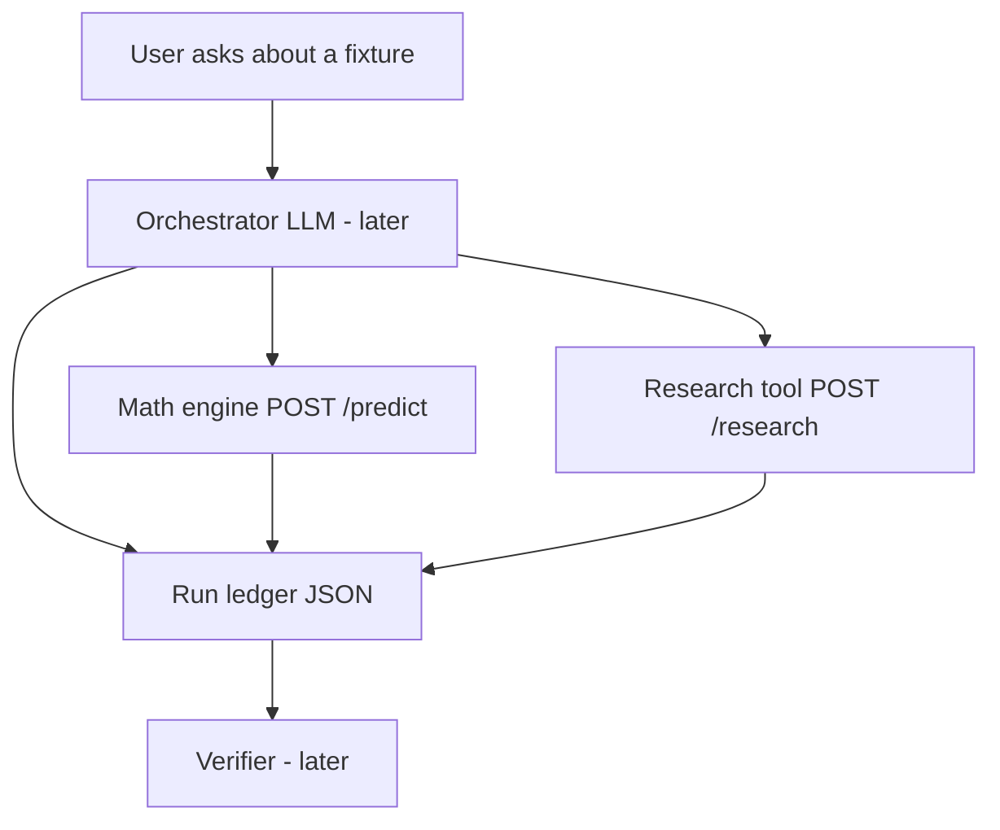

# Module 1: Qualitative Research Tool

## Goal

A **facts-only** tool the Orchestrator calls for one upcoming fixture. It casts a wide free net, prioritises official [nrl.com/news](https://www.nrl.com/news/), tags reliability tiers (especially Reddit), filters to **this round / this fixture**, and returns structured JSON — no LLM analysis in this module.

Same delivery pattern as the math engine: **CLI for testing + `POST /research` FastAPI**.

## System fit



Remaining modules after this: **Orchestrator**, then **Verifier** (ingests the ledger).

## Agreed decisions (from discussion)

| Decision | Choice |
| --- | --- |
| LLM inside research module | **No** (facts only; Orchestrator reasons later) |
| Delivery | FastAPI `POST /research` + CLI |
| Cost | $0 retrieval; multi-channel free sources |
| Primary channel | **nrl.com** news (Team Lists, Injuries, Match Preview, club hubs) |
| Wide net | DuckDuckGo news + Google News RSS |
| Reddit | Include as `source_tier: unverified_community` — less weight; prefer corroboration |
| Cache | Per fixture, **expire next calendar day** (local) |
| Usage | ~1 run per game, 1–3 games/day — polite delays still, soft-fail per channel |
| Article bodies | Fetch top ~3–5 relevant **nrl.com** articles per game |
| Recency | Filter to **this fixture / this round**, using publish times (+ title round cues) |
| Ledger | Design responses now so every tool call can be appended to a run ledger |

## Package layout (new top-level module)

Outside `mathematical_engine/` — separate concern:

```
qualitative_research/
  pyproject.toml          # uv project; can depend on shared patterns or copy HTTP client
  README.md
  Architecture.md         # detailed design (like api/Architecture.md)
  research/
    __init__.py
    queries.py            # query templates for a fixture
    channels/
      nrl_news.py         # topic + club pages + article fetch (official)
      duckduckgo.py       # reuse Web_searcher approach
      google_news_rss.py
      reddit.py           # r/nrl, low trust
    filter.py             # dedupe, recency, fixture relevance
    cache.py              # day-expiry disk cache
    assemble.py           # merge channels → ResearchResponse
    ledger_types.py       # shared shapes for tool I/O records
  api/
    main.py
    routes.py
    schemas.py
  cli.py                  # `uv run python -m research.cli ...`
```

Reuse ideas from [`mathematical_engine/reference_files/Web_searcher.py`](mathematical_engine/reference_files/Web_searcher.py) and polite HTTP from [`mathematical_engine/nrl_scraping/http.py`](mathematical_engine/nrl_scraping/http.py). Prefer a small shared delay/retry client inside this package (or extract shared HTTP later) — do not couple research imports tightly to the math engine.

## Channel design

### 1. nrl.com (official — primary)

Same scraping style as match centre: fetch HTML, parse links / `q-data` where present.

Per fixture:

1. Fetch topic hubs: Team Lists, Injuries, Match Preview ([topic URLs on nrl.com/news](https://www.nrl.com/news/))
2. Fetch club hubs: `/news/club/{home}/`, `/news/club/{away}/`
3. Collect cards: title, topic tag, href, **published timestamp**
4. Filter for relevance + recency (below)
5. Fetch top 3–5 article bodies (paragraph extract or Vue payload if available)
6. Emit items with `source_tier: "official"`

Skip noise topics by default: Fantasy, Tipping, Match Highlights (especially historical “1970” videos).

### 2. DuckDuckGo news + Google News RSS (wide net)

3–4 queries, e.g. `{home} {away} NRL`, `{home} injury OR team list`, `{away} injury OR team list`, optional round query. Cap hits; dedupe by URL.

`source_tier: "mainstream_news"` (or `search_discovery` if source unknown).

### 3. Reddit `r/nrl`

Small capped search. Every item:

```json
"source_tier": "unverified_community",
"reliability": "low",
"guidance": "Treat as rumour unless corroborated by official or mainstream_news items."
```

Soft-fail on 429; do not fail the whole tool.

## Recency and “this fixture, not last time we played”

Problem: Bulldogs vs Tigers earlier in the season must not pollute this week’s run. Relative labels like “2 hours ago” on cards are useful UI cues; prefer **absolute publish times** from HTML/`q-data` when available, fall back to parsing relative times.

**Filter rules (deterministic):**

1. **Time window:** keep items published within **N days before kickoff** (default **10 days**, configurable). Drop older pieces even if they mention both teams.
2. **Round cue:** if title/body contains `Round {k}` and the request includes `round_number`, prefer matches; drop clear mismatches (e.g. Round 4 when predicting Round 21).
3. **Pairing cue:** if both team names appear with an old date outside the window → drop.
4. **Topic boost:** Late Mail / Casualty Ward / Match Preview for the current round always preferred when in-window.
5. Attach to every item: `published_at` (ISO), `age_hours`, `relevance_score` / reasons for keep/drop (helps ledger + Verifier).

## Response contract (`POST /research`)

**Request:** `home_team`, `away_team`, `kickoff`, optional `round_number`, `venue`.

**Response (facts + metadata for ledger):**

```json
{
  "tool": "qualitative_research",
  "tool_version": "0.1.0",
  "request": { "home_team": "...", "away_team": "...", "kickoff": "...", "round_number": 21 },
  "retrieved_at": "2026-07-23T05:30:00Z",
  "cache_hit": false,
  "channels": {
    "nrl_news": { "status": "ok", "items_kept": 4 },
    "duckduckgo": { "status": "ok", "items_kept": 6 },
    "google_news_rss": { "status": "ok", "items_kept": 5 },
    "reddit": { "status": "rate_limited", "items_kept": 0, "error": "429" }
  },
  "items": [
    {
      "id": "...",
      "source_tier": "official",
      "channel": "nrl_news",
      "category": "team_lists",
      "title": "NRL Late Mail: Round 21 - Panthers lose Edwards",
      "url": "https://www.nrl.com/news/...",
      "published_at": "2026-07-23T02:00:00Z",
      "snippet": "...",
      "body_excerpt": "...",
      "reliability": "high",
      "guidance": null
    }
  ],
  "queries_run": ["..."],
  "filter_summary": { "dropped_stale": 12, "dropped_wrong_round": 3 }
}
```

No “who will win” — evidence only.

## Day cache

- Key: hash of `(home, away, kickoff_date, round_number)`
- Store under `qualitative_research/cache/` (gitignored)
- Expire at **next local calendar day** (or end of kickoff date in AU/Sydney)
- Cache hit still returns full response with `cache_hit: true` (ledger records that)

## Run ledger (build the foundation now)

Full ledger is owned by the **Orchestrator**, but Module 1 must be ledger-ready from day one.

**`qualitative_research/research/ledger_types.py`** defines:

```text
ToolCallRecord:
  call_id, tool_name, started_at, finished_at, request, response, error, duration_ms
```

Research API/CLI always returns the full response body above (never truncated “summary only”). Document in Architecture.md that Orchestrator must:

1. Create `run_id` + `ledger.json` at start of each agent run  
2. Append every tool call (math + research) with **full** request/response  
3. Append agent messages / reasoning / final judgement  
4. Persist under e.g. `agent_runs/{run_id}/ledger.json`  

Verifier later: **read ledger only** — no re-scraping.

Optional small helper in this module: `append_tool_record(ledger_path, record)` so Orchestrator can reuse one writer. Stub CLI flag `--write-ledger path` for manual testing now.

## Rate limiting (given 1–3 games/day)

Still implement:

- ~1 req/s per host  
- Caps (queries, hits, article fetches, Reddit posts)  
- Soft-fail per channel  
- Day cache  

Not aggressive parallelism.

## Implementation todos

1. Scaffold `qualitative_research/` uv project + README + Architecture.md  
2. HTTP client + day cache + query templates  
3. nrl.com channel (list pages + article bodies + topic filters)  
4. DDG + Google News RSS channels  
5. Reddit channel with low-trust metadata  
6. Recency / fixture / round filter + dedupe  
7. Assemble → ResearchResponse; CLI  
8. FastAPI `POST /research` + `GET /health`  
9. Ledger types + `--write-ledger` hook; document Orchestrator contract  
10. Smoke test on a real upcoming fixture; gitignore cache  

## Out of scope (this module)

- LLM summarisation / match prediction  
- Orchestrator chat UI  
- Verifier logic (only ledger shape)  
- Storing news into the math data lake  
- Paid search APIs  

## Success criteria

- One CLI/API call for a fixture returns multi-channel JSON with tiers and publish times  
- Stale / wrong-round nrl.com items largely excluded  
- Reddit items always carry low-trust guidance  
- Cache: second call same day is a hit  
- Response is complete enough to paste into a ledger without loss  
- Architecture.md documents channels, filters, ledger contract for the report  
