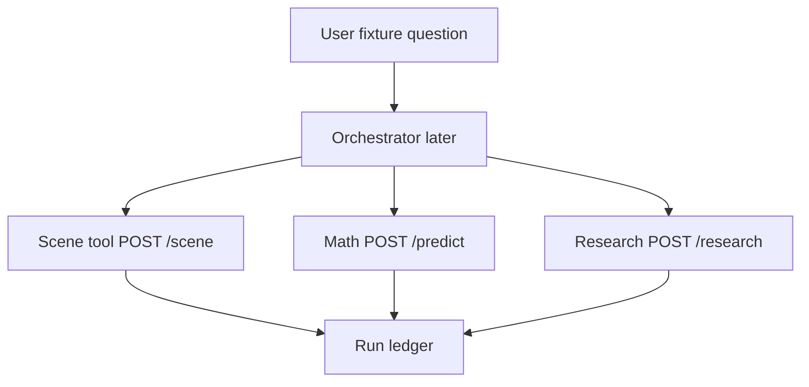

# Module: Fixture Scene Setter

## Goal

Compulsory first tool in the agent pipeline:

```text
user prompt → set scene → research + math → judgement → prediction
```

Facts only (no LLM): resolve the upcoming fixture on nrl.com, extract structured match context, attach a free kickoff-time weather forecast. Delivery matches existing tools: **CLI + FastAPI**.

Research is signed off; query cleanup that removes weather/venue/ref search terms is **deferred until after this module lands**.

## System fit



## Defaults (locked)

| Decision | Choice |
| --- | --- |
| Package | New top-level [`fixture_scene/`](fixture_scene/) (same pattern as [`qualitative_research/`](qualitative_research/)) |
| Weather | **Open-Meteo** forecast API (free, no key) at venue lat/lon for kickoff hour |
| NRL source | Draw `q-data` (`#vue-draw`) to find fixture → match centre `q-data` (`#vue-match-centre`) for detail |
| Coupling | **Do not import** math-engine packages; reuse the same HTTP/`q-data` patterns by copying a small local client (as research did) |
| Cache | Day-expiry AU/Sydney disk cache (same idea as research); gitignored |
| Timing assumption | Operator runs ~1h before kickoff — team lists/officials usually present; soft-null if missing |

## Inputs / outputs

**Request:** `home_team`, `away_team` (NRL nicknames), optional `season`, optional `round_number`. If round/season omitted, discover from current draw (AU “now”).

**Response (ledger-ready):**

```json
{
  "tool": "fixture_scene",
  "tool_version": "0.1.0",
  "request": { "home_team": "Eels", "away_team": "Panthers" },
  "retrieved_at": "...",
  "cache_hit": false,
  "fixture": {
    "season": 2026,
    "round_number": 21,
    "round_title": "Round 21",
    "home_team": "Eels",
    "away_team": "Panthers",
    "kickoff": "2026-07-23T19:50:00+10:00",
    "venue": "CommBank Stadium",
    "venue_city": "Sydney",
    "match_centre_url": "https://www.nrl.com/draw/...",
    "match_mode": "Pre",
    "ground_conditions": null,
    "officials": [{ "position": "Referee", "name": "Gerard Sutton" }],
    "team_lists": {
      "home": [{ "number": 1, "name": "Isaiah Iongi", "position": "Fullback" }],
      "away": [],
      "status": "available"
    }
  },
  "weather": {
    "provider": "open-meteo",
    "at_kickoff": {
      "temperature_c": 14.2,
      "precipitation_mm": 0.0,
      "precipitation_probability_pct": 20,
      "wind_speed_kmh": 18.0,
      "weather_code": 3,
      "summary": "Overcast"
    },
    "math_weather_label": "Fine",
    "source_url": "https://api.open-meteo.com/v1/forecast?..."
  },
  "sources": { "draw_url": "...", "match_centre_url": "..." }
}
```

`math_weather_label` maps forecast → coarse label (`Fine` / `Rain` / `unknown`) aligned with math engine’s optional `--weather` / `ctx_weather` categories so Orchestrator can pass it into [`mathematical_engine/model/serving.py`](mathematical_engine/model/serving.py) later.

## Implementation approach

### 1. Scaffold

```text
fixture_scene/
  pyproject.toml
  README.md
  Architecture.md
  scene/
    http_client.py      # polite requests client
    draw.py             # vue-draw fetch + find upcoming fixture
    match_centre.py     # vue-match-centre extract
    venues.py           # venue name → (lat, lon) + city fallbacks
    weather.py          # Open-Meteo at kickoff
    assemble.py         # SceneResponse
    cache.py            # day-expiry
    ledger_types.py     # same ToolCallRecord helper pattern
    cli.py
  api/
    main.py / routes.py / schemas.py
```

Root [`.gitignore`](.gitignore): add `/fixture_scene/cache`. Root [`README.md`](README.md): short operator section.

### 2. Draw resolution ([`draw_scraper.py`](mathematical_engine/historical_data_backfill_etl/draw_scraper.py) pattern)

- Fetch `https://www.nrl.com/draw/?competition=111&round={r}&season={y}`
- Parse `#vue-draw` `q-data`
- Keep fixtures with `type == "Match"` and `matchMode` in `Pre` / `Live` (not only `Post` — invert the completed-only filter used by ETL)
- Match home/away by case-insensitive `nickName`
- If `round_number` omitted: use draw’s selected/current round from payload if present; else scan nearby rounds in `filterRounds` until the pairing is found
- Return `matchCentreUrl`, kickoff fields available on fixture card, venue if present

### 3. Match centre enrichment ([`match_scraper.py`](mathematical_engine/nrl_scraping/match_scraper.py) pattern)

- Fetch match centre HTML → `#vue-match-centre` `q-data`
- Extract: `venue`, `venueCity`, kickoff/start time, `officials[]`, `groundConditions` if any, team list / players from home/away team blocks when present
- Soft-null `team_lists` with `status: unavailable` if not named yet (should be rare ~1h pre-kickoff)

### 4. Weather

- Maintain `VENUE_TO_COORDS` for venues in math’s [`VENUE_TO_STATE`](mathematical_engine/feature_engineering/flatten.py) (seed major stadiums; unknown venue → geocode via Open-Meteo’s free geocoding using `venue_city` + Australia, or soft-fail weather)
- Call Open-Meteo hourly forecast; pick the hour closest to kickoff (Australia/Sydney)
- Soft-fail weather without failing the whole tool

### 5. API / CLI / ledger

- `POST /scene`, `GET /health` (port **8002** in docs to sit beside math 8000 / research 8001)
- CLI: `uv run python -m scene.cli --home Eels --away Panthers [--round 21] [--force-refresh] [--write-ledger path]`
- Reuse research’s ledger append helper shape in local `ledger_types.py`

### 6. Smoke test

- Real upcoming fixture (e.g. Eels v Panthers if still Pre, else next listed draw match)
- Assert: kickoff, venue, URL present; weather block present or soft error; cache hit on second call same day

## Out of scope

- Orchestrator wiring
- Trimming qualitative research queries (follow-up after this lands)
- Changing math engine scrape filters
- Paid weather APIs

## Success criteria

- One CLI/API call with home/away returns fixture + weather JSON suitable to paste into a ledger
- Does not require the user to pass venue/kickoff (discovered from nrl.com)
- Soft-fails team lists / weather without aborting
- Architecture.md documents Orchestrator contract: call scene first, then pass scene fields into math/research
