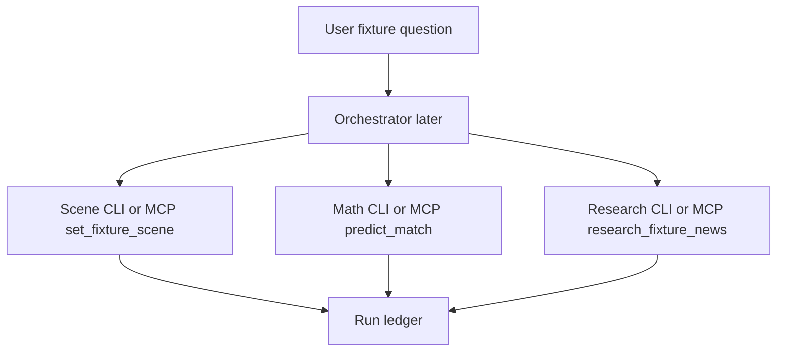

# Fixture Scene Tool — Architecture

Facts-only scene setter for upcoming NRL fixtures. The Orchestrator should
call this **first** (via MCP `set_fixture_scene` or CLI) so research and math
receive kickoff, venue, officials, team lists, and a coarse weather label.
No LLM.

Companion tools:

- Math engine: `../mathematical_engine/` (CLI / MCP `predict_match`)
- Qualitative research: `../qualitative_research/` (CLI / MCP `research_fixture_news`)
- Agent integration: `../mcp_gateway/` (stdio MCP server)

## 1. Role in the system

| Concern | Owner |
| --- | --- |
| Kickoff, venue, officials, team lists, weather label | **This module** |
| Numbers + SHAP | Mathematical engine |
| Headlines, injuries, team news | Qualitative research |
| Reasoning / final pick | Orchestrator (not built yet) |

**Orchestrator contract:** call scene first; pass `fixture.kickoff`,
`fixture.venue`, and `weather.math_weather_label` into math/research as needed.
Do not ask the user for venue/kickoff when scene can discover them.

## 2. Sources

| Source | Role |
| --- | --- |
| nrl.com draw (`#vue-draw` `q-data`) | Find upcoming Pre/Live fixture by nickName |
| nrl.com match centre (`#vue-match-centre` `q-data`) | Venue, kickoff, officials, team lists |
| Open-Meteo forecast API | Hourly weather at venue lat/lon nearest kickoff |
| Open-Meteo geocoding | Soft fallback when venue not in local coords table |

Does **not** import mathematical_engine packages; HTTP/`q-data` patterns are local copies.

## 3. Soft-fail behaviour

| Missing piece | Behaviour |
| --- | --- |
| Team lists not named yet | `team_lists.status: unavailable`, empty arrays |
| Weather / coords fail | `weather.error` set; fixture still returned |
| Match centre HTML broken | `fixture.match_centre_error`; draw card fields kept |
| Fixture not on draw | CLI exit 1 / MCP JSON `error: fixture_not_found` |

Timing assumption: operator runs ~1h before kickoff — lists/officials usually present.

## 4. Cache

Day-expiry disk cache under `cache/` (Australia/Sydney **calendar day**).
Gitignored. Files are not deleted when expired; they are ignored on load.

## 5. Ledger

CLI `--write-ledger path` appends a `ToolCallRecord` (same shape as research)
so the Verifier can audit scene → research → math later.

## 6. `math_weather_label`

Maps Open-Meteo hourly fields → `Fine` / `Rain` / `unknown` so Orchestrator can
pass the label into the math engine’s optional weather / `ctx_weather` input.

## 7. Delivery

CLI for humans; MCP gateway for the agent. Per-tool FastAPI was removed
(see [`mcp_gateway/Architecture.md`](../mcp_gateway/Architecture.md)).
