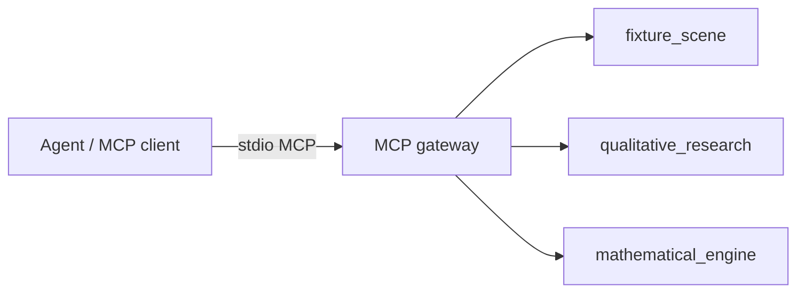

# MCP Gateway — Architecture

The agent talks to **one** MCP server. That server calls the same library
functions the CLIs use. Per-tool FastAPI servers were removed as redundant.

## Decisions

| Choice | Rationale |
| --- | --- |
| MCP over per-tool HTTP | One discovery surface + schemas for the agent; less ops (no 3 ports) |
| Keep CLIs | Human/demo testing without an MCP host |
| In-process calls | No HTTP hop; same `predict_fixture` / `research_scene` / `research_fixture` |
| JSON strings as tool results | Stable text content for MCP clients; ledger can `json.loads` later |

## Tool policy (Orchestrator)

1. Call `set_fixture_scene` first (kickoff / venue / weather / officials).
2. Pass scene fields into `research_fixture_news` and `predict_match`.
3. Optional `queries` on `research_fixture_news` — agent-authored list (max 6),
   **merged with** the built-in templates rather than replacing them (DD-29);
   omit for CLI/default templates. Do not re-search weather/venue/officials.
4. Wire `predict_match` `weather` from `scene.weather.math_weather_label`.
5. Tools return **facts only** — winner judgement stays in the agent.

## What was removed

- `tools/mathematical_engine/api/` FastAPI (`:8000`)
- `tools/qualitative_research/api/` FastAPI (`:8001`)
- `tools/fixture_scene/api/` FastAPI (`:8002`)

Those layers duplicated CLI entrypoints. Historical design notes live under
`plans/math_engine_plans/phase_4b_fastapi_endpoint.plan.md` (superseded for
agent integration).
