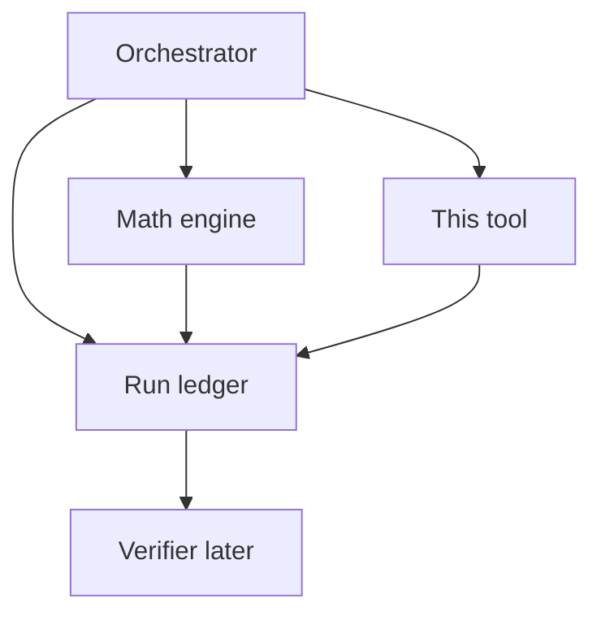

# Qualitative Research Tool — Architecture

Zero-cost, facts-only research for upcoming NRL fixtures. The Orchestrator
calls this tool for qualitative context (injuries, Late Mail, headlines);
it does **not** predict winners and does **not** use an LLM.

Companion: math engine at `../mathematical_engine/` (CLI / MCP `predict_match`);
agent integration at `../mcp_gateway/`.

## 1. Role in the system



| Concern | Owner |
| --- | --- |
| Kickoff, venue, officials, weather label | Fixture scene (CLI / MCP `set_fixture_scene`) |
| Numbers + SHAP | Mathematical engine |
| Headlines, injuries, team news, form | **This module** |
| Reasoning / final pick | Orchestrator (not built yet) |
| Audit / contradiction check | Verifier (reads ledger) |

## 2. Channels

| Channel | Tier | Role |
| --- | --- | --- |
| **nrl.com** topics + club hubs + article bodies | `official` / high | Primary: Late Mail, Casualty Ward, previews |
| DuckDuckGo news | `mainstream_news` | Wide discovery |
| Google News RSS | `search_discovery` | Backup wide net (no API key) |
| Reddit `r/nrl` | `unverified_community` / low | Rumour radar; must be corroborated |

Reddit items always include:

> Treat as rumour unless corroborated by official or mainstream_news items.

If Reddit returns 403/429, the channel soft-fails (`status: error` / `rate_limited`)
and the rest of the response still succeeds.

**Known limitation (not fixed yet):** In practice, Reddit has **consistently failed**
during Module 1 testing. Unauthenticated `.json` endpoints return a bot-wall
**403**; the Atom RSS fallback (`/r/nrl/new/.rss`) worked once as a probe, then
this environment started getting **429 / 403 Blocked** after repeated requests.
The channel code is kept (soft-fail) so official + DDG + Google News still run.
A reliable fix later would likely need Reddit OAuth (still free) or a different
community source (e.g. Bluesky) — not done yet.

Noise topics skipped on nrl.com: Fantasy, Tipping, Match Highlights, NRLW when
researching men’s fixtures.

## 3. Recency / this-fixture filtering

Problem: Bulldogs vs Tigers earlier in the season must not pollute this week.

Rules (`research/filter.py`):

1. Keep items published within **N days before kickoff** (default 10)
2. If title has `Round K` and request has `round_number`, drop mismatches
3. Drop clear other-fixture previews using **known NRL club nicknames** only
   (`Eels vs Panthers Preview` is kept; `Eels v Warriors` is dropped)
4. Drop Fantasy / Tipping / Highlights, historical-year noise, NRLW, NFL collisions
5. Require a **rugby-league signal** — a league marker in the text, `nrl` or
   `rugby-league` in the URL path, or official provenance. Roughly half the
   NRL's nicknames belong to clubs in other codes, so "Titans" alone has
   previously admitted a Tennessee Titans report and a *Remember the Titans*
   celebrity story (DD-37)
6. Require mention of home/away **or** league-wide Late Mail / Casualty / Team Lists
   **or** same-round league roundups (tips / teams / odds / line-ups). Team
   matching accepts city/region names as well as nickNames, so
   "Gold Coast" resolves to Titans and "North Queensland" to Cowboys
   (`TEAM_REGION_ALIASES` in `research/queries.py`)
7. Prefer absolute timestamps; fall back to “2 hours ago” / Yesterday; reject ISO durations (`PT4M47S`)
8. Each kept item carries `published_at`, `age_hours`, `keep_reasons`
9. Contextual cues (travel, form, suspension, judiciary, …) get a small
   relevance boost when kept. Weather / venue / referee are **not** boosted —
   those facts come from `fixture_scene`.

### Two-pass relevance (DD-28)

Rules 5 and 6 can only see the title, snippet and category, because bodies are
fetched later. An article that names the fixture, or the code, *only in its
text* — routine for official club pages and round wraps — would be lost on the
title alone.

So an item that fails only those two rules is **deferred**, not dropped:

```
pass 1  filter_items()                → kept + deferred + dropped
        attach_article_bodies(kept + deferred[:15])
pass 2  promote_deferred_with_bodies()→ promoted (merged into kept) or dropped
```

Every other rule (noise, staleness, wrong round, other-fixture) still drops
immediately, so the second pass only ever reconsiders whether the article is
about rugby league and about this fixture. Deferred
body fetches are capped at 15 to bound the extra latency.
`filter_summary` reports `deferred_pending_body` and `promoted_after_body`.

Body extraction reads headings, paragraphs, lists, tables, and compact widget
text (team-list UIs), not only `<p>` tags, and strips Acknowledgement /
subscribe boilerplate. Google News RSS links are decoded to publisher URLs.
Per-article soft-fail if a publisher blocks scraping.

### Queries

Default templates: match pairing + per-team injury/Late Mail/suspension +
form/preview (+ optional round). **Not** searched here (owned by
[`fixture_scene`](../fixture_scene/Architecture.md)): weather, venue forecast,
kickoff, match officials. Optional API `venue` is still accepted for request
echo / future use but does not drive search.

Agent callers may pass `queries: list[str]` (max 6). These are **merged with**
the defaults, not substituted for them (DD-29), capped at 10 total, agent
queries first. Replacement used to let a weak LLM query plan silently disable
the tuned availability coverage the research gate depends on.

Each channel takes up to 12 results per query. DuckDuckGo retries a failed
query twice with backoff (its news endpoint intermittently 403s) and reports
`status: error` only if every query failed.

`queries_run` is deduped in the response (DDG and Google News share templates).
Cache key includes a hash of custom queries when provided.

**Dropped-sources audit (local only):** every fresh run writes
`debug/dropped/{cache_key}.json` with the full list of filtered-out titles/URLs
and drop reasons (including `dropped_no_body` for pages that failed body
extraction). This file is **not** included in the tool response, day cache,
or anything sent to the LLM. Gitignored under `tools/qualitative_research/debug/`.

Items without a usable `body_excerpt` are removed from the tool response after
fetching so the Orchestrator only sees evidence with actual text.

After URL resolve, items that point at the **same publisher URL** (e.g. official
nrl.com Late Mail also discovered via Google News) are collapsed to one record,
preferring `official` / `nrl_news` and richer bodies (`dropped_duplicate_url`
in the local audit).

## 4. Day cache

- Key: hash of `(home, away, kickoff_date, round_number[, queries])`
- Files under `cache/` (gitignored)
- Expires at **next Australia/Sydney calendar day**
- Same fixture same day → `cache_hit: true`, no network
- Force refresh: CLI `--force-refresh` / MCP `force_refresh=true`

## 5. Response contract

CLI / MCP return the same JSON including `channels`, `items`, `queries_run`,
`filter_summary`. Never truncated: the ledger needs the complete payload.

## 6. Run ledger (Orchestrator contract)

This module defines `ToolCallRecord` in `research/ledger_types.py` and can
append to a ledger via CLI `--write-ledger path`.

**Orchestrator must:**

1. Create `agent_runs/{run_id}/ledger.json` at start of each run
2. Append every tool call (scene + math + research) with **full** request/response
3. Append agent reasoning steps and final judgement
4. Hand the ledger to the Verifier — Verifier does not re-scrape

## 7. Rate limiting

~1 req/s per host, retries with backoff, soft-fail per channel, caps on
queries/hits/article fetches. Safe for 1–3 games/day.

## 8. Usage

```bash
cd qualitative_research
uv sync

uv run python -m research.cli \
  --home Broncos --away Storm \
  --kickoff 2026-07-25T19:30:00+10:00 --round 21

# Agent: mcp_gateway tool research_fixture_news
```
