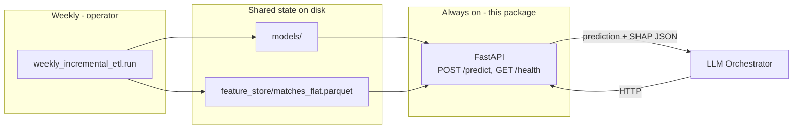

# The Serving Layer: FastAPI Prediction Endpoint

How Phase 4b exposes the mathematical engine as an HTTP tool for the LLM
Orchestrator. Companion docs: [../model/Architecture.md](../model/Architecture.md)
(how the model is trained and evaluated), [../Overview.md](../Overview.md)
(the system rationale and the JSON hand-off contract), and the project root
README (operator runbook).

## 1. What this layer is — and is not

This package is a **thin HTTP wrapper** around prediction code that already
existed and was already tested (`model.predict`). It adds no new prediction
logic. Its entire job:

1. Accept a fixture over HTTP (`POST /predict`)
2. Call the same `predict_fixture()` function the CLI uses
3. Return the Overview-format JSON payload
4. Report model freshness (`GET /health`)

It deliberately does **not**:

| Out of scope | Where that lives instead |
| --- | --- |
| Scrape match data | `weekly_incremental_etl.run` (operator, weekly) |
| Rebuild features | same weekly ETL |
| Retrain the model | same weekly ETL |
| LLM reasoning / news analysis | the Orchestrator (separate capstone component) |

**The decoupling rule:** the API and the weekly ETL never call each other.
Their only connection is the `models/` directory (and
`feature_store/matches_flat.parquet`, which `inference.py` reads). The
operator refreshes those; the API just serves whatever is there.



## 2. Files in this package

| File | Responsibility |
| --- | --- |
| `main.py` | FastAPI app: startup warm-up, CORS, router registration |
| `routes.py` | The two endpoints and error-code mapping |
| `schemas.py` | Pydantic request/response models (validation + OpenAPI docs) |
| `../model/serving.py` | The actual work: artifact loading, hot-reload, `predict_fixture()` |

`model/serving.py` lives in the `model` package (not here) because it is
shared: `model/predict.py` (the CLI) is now a thin wrapper around the same
functions. One code path for CLI and HTTP means the two can never disagree —
the same reasoning as the train/inference parity design (DD-23).

## 3. Endpoints

### `POST /predict`

**Request:**

```json
{
  "home_team": "Broncos",
  "away_team": "Storm",
  "venue": "Suncorp Stadium",
  "kickoff": "2026-07-04T09:30:00Z",
  "weather": "Fine",
  "top_k": 5
}
```

| Field | Required | Notes |
| --- | --- | --- |
| `home_team` | yes | NRL nickname (`Broncos`, `Wests Tigers`, ...) — case-insensitive |
| `away_team` | yes | same |
| `venue` | yes | should match a `VENUE_TO_STATE` key in `flatten.py`; unknown venues still predict but log a warning and default the travel flag |
| `kickoff` | yes | ISO 8601 date or datetime |
| `weather` | no | `Fine`, `Rain`, ... omitted = `unknown` |
| `top_k` | no | SHAP drivers per direction, 1–20, default 5 |

**Response (200):** identical to the `model.predict` CLI output — the
Overview.md hand-off contract:

```json
{
  "prediction": "Away Win",
  "probability": 0.5643,
  "home_win_probability": 0.4357,
  "shap_explanations": {
    "positive_drivers": ["3-game form: errors (+3.67)", "..."],
    "negative_drivers": ["Elo rating advantage (-71 points)", "..."]
  },
  "fixture": {
    "home_team": "Broncos",
    "away_team": "Storm",
    "venue": "Suncorp Stadium",
    "kickoff": "2026-07-04T09:30:00Z",
    "weather": "unknown"
  }
}
```

Reading it: `probability` is the calibrated confidence in `prediction`;
`home_win_probability` is always from the home side's perspective.
`positive_drivers` push toward a home win, `negative_drivers` toward an
away win, each phrased from the Feature Dictionary definitions.

**Error responses:**

| Status | Meaning | Typical cause |
| --- | --- | --- |
| `404` | No trained model | `models/` empty — run `model.train` or the weekly ETL |
| `422` | Invalid input | Unknown team name (response lists valid teams), malformed body |
| `503` | Feature store missing | `matches_flat.parquet` absent — run the weekly ETL |

**Latency:** ~20–25 seconds per prediction. Most of that is
`inference.py` rebuilding the fixture's features from full history (the
Bradley-Terry refit dominates). Acceptable for an agent tool called a few
times per session; see §6 for options if it ever needs to be faster.

### `GET /health`

```json
{
  "status": "ok",
  "model_loaded": true,
  "trained_at": "2026-07-02T05:22:13.177226+00:00",
  "n_training_rows": 2330,
  "training_seasons": [2015, 2026],
  "calibration_method": "sigmoid"
}
```

Answers two operator questions: *is the server up?* and *which model would
it serve right now?* After a weekly ETL run, `trained_at` should move
forward — if it doesn't, something is wrong. Returns
`{"status": "degraded", "model_loaded": false}` (still HTTP 200) when no
model exists yet.

### `GET /docs`

FastAPI's auto-generated interactive documentation (Swagger UI). Useful for
demos and manual testing — you can fire test requests from the browser.

## 4. Artifact hot-reload (the one clever part)

**Problem.** The server loads `model.ubj` into memory. The weekly ETL later
overwrites the file on disk. Without intervention the running server would
keep serving the *old* model until restarted.

**Solution.** `model/serving.py` keeps a singleton `ModelBundle` and, before
every request, compares the modification time of `models/metrics.json`
against the value recorded at load. `train.py` writes `metrics.json` last,
so a changed mtime means a complete new artifact set is on disk. On change,
the bundle transparently reloads.

**Why `metrics.json` and not `model.ubj`?** Because it is written last. If
we watched `model.ubj` we could reload mid-way through a training run and
pair a new model with a stale calibrator. Watching the last-written file
makes the artifact swap effectively atomic.

**Cost:** one `stat()` syscall per request, plus ~1 second on the rare
request that triggers a reload. Verified working in the smoke test: touching
`metrics.json` caused `reloading artifacts` on the next request.

**Operator consequence:** start the server once and leave it running. Weekly
ETL runs don't require a restart.

## 5. Security posture (capstone MVP)

- Binds to `127.0.0.1` — not reachable from other machines.
- No authentication. Anyone on this machine can call it.
- CORS allows `localhost` origins only, for a locally-run Orchestrator or
  browser UI.

This is appropriate for a local capstone demo. A production deployment would
need, at minimum: an API key or OAuth, TLS, rate limiting, and network
isolation. Documented as future work rather than built, per the plan.

## 6. Performance notes and future options

Current per-request cost is dominated by feature building, not the model
(XGBoost inference on one row is microseconds):

| Step | Approx. time |
| --- | --- |
| Load flat table + append synthetic row | ~1s |
| Elo/Pythagorean | ~1s |
| **Bradley-Terry refit per kickoff** | **~18s** |
| Rolling features, SHAP, response | ~2s |

If the agent ever needs sub-second responses, options in order of
preference:

1. **Cache per (team, team, venue, kickoff)** — repeated questions about the
   same fixture become instant.
2. **Precompute round features** — after each weekly ETL, build feature
   vectors for the *next* round's fixtures and serve from cache.
3. **Incremental BT** — keep BT strengths warm-started instead of refitting
   from scratch (would need a parity re-verification).

None of these are needed for the capstone; noted for the report's
future-work section.

## 7. How to run it

From `mathematical_engine/`:

```bash
# Start the server (leave running)
uv run uvicorn api.main:app --host 127.0.0.1 --port 8000

# Liveness + model freshness
curl -s http://127.0.0.1:8000/health

# A prediction
curl -s -X POST http://127.0.0.1:8000/predict \
  -H "Content-Type: application/json" \
  -d '{
    "home_team": "Broncos",
    "away_team": "Storm",
    "venue": "Suncorp Stadium",
    "kickoff": "2026-07-04T09:30:00Z"
  }'
```

Interactive docs: <http://127.0.0.1:8000/docs>

## 8. Design decisions specific to this layer

| Decision | Alternative | Rationale |
| --- | --- | --- |
| Thin wrapper over shared `serving.py` | Separate HTTP prediction code | One code path — CLI and API can never diverge (same philosophy as DD-23) |
| Hot-reload on `metrics.json` mtime | Restart server after weekly ETL | Zero-touch operations; ETL and API stay fully decoupled |
| Watch `metrics.json`, not `model.ubj` | Watch the model file | metrics.json is written last, making the artifact swap atomic |
| `422` vs `503` error split | One generic 500 | Unknown team is the caller's problem; missing feature store is the operator's — different audiences need different signals |
| Warm model at startup via lifespan | Lazy-load on first request | First prediction is already slow (~25s); don't add load time to it |
| Localhost + no auth | API keys, TLS | Capstone MVP scope; production hardening documented as future work |
