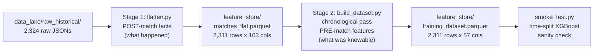

# Feature Engineering Pipeline: Architecture & Implementation

How Phase 2 of the Mathematical Engine works: the design, the algorithms,
the safeguards, and the evidence that it is correct. Companion documents:
[../Feature_Dictionary.md](../Feature_Dictionary.md) (what each feature
means and why it exists) and
[../Data_Quality_Findings.md](../Data_Quality_Findings.md) (raw-data
constraints this pipeline was designed around).

## 1. Purpose and position in the system

The LLM Orchestrator must never do arithmetic. This pipeline converts the
raw data lake (2,324 scraped match-centre JSON payloads, 2015-2026) into a
single model-ready table — `feature_store/training_dataset.parquet` — on
which the XGBoost classifier (Phase 3) trains. Every design decision below
serves two non-negotiables:

1. **No leakage.** A feature attached to match N may only use information
   that existed before kickoff of match N. A model trained on leaky
   features looks brilliant in backtests and fails in production.
2. **No fabrication.** Missing data stays missing (NaN). XGBoost handles
   missing values natively by learning a default branch direction at each
   split; imputing would inject invented signal.

## 2. The two-stage architecture



The split exists because of the leakage rule. Stage 1 answers "what
happened in this match?" — it may freely read the match's own stats
because its output is *facts*, not features. Stage 2 answers "what was
knowable before kickoff?" — it walks matches in strict chronological
order and only ever aggregates *earlier* rows. The boundary between the
stages is exactly the boundary between post-match and pre-match
information, which makes the leakage property auditable: any feature
computed in Stage 2 from shifted/cumulative quantities is safe by
construction.

A secondary benefit: the upcoming weekly incremental pipeline (Job B)
reuses Stage 1 unchanged on each new round's JSON and simply re-runs
Stage 2, which takes seconds.

## 3. Stage 1: `flatten.py`

Input: every `data_lake/raw_historical/{season}/nrl_match_*.json`.
Output: one row per match in `matches_flat.parquet`, sorted by kickoff
time. Five parsing concerns:

### 3.1 Team statistics (`stats.groups`)

The payload nests ~36 team stats in titled groups (Possession &
Completions, Attack, Passing, Kicking, Defence, Negative Play,
Interchanges). Each stat title is normalised to a snake_case column with
home/away prefixes (e.g. "Post Contact Metres" → `home_post_contact_metres`,
`away_post_contact_metres`; "Possession %" → `possession_pct`). Whatever
stats a given era recorded are captured; absent stats yield NaN columns
for that row (the NaN rule — e.g. "Completion Rate" is largely absent
2015-2018).

### 3.2 Timeline aggregates (`timeline` array)

The timeline is an event stream (tries, goals, penalties, interchanges...)
each stamped with `gameSeconds` and a `teamId`. Stage 1 reduces it to:

- **Last-20-minutes points** per side: scoring events (Try=4, Goal=2,
  1pt/2pt field goals) within regulation gameSeconds 3600-4800. Extra time
  is excluded so golden point does not contaminate the fatigue signal.
- **First scorer**: which side produced the earliest scoring event.
- **Discipline gap**: mean seconds between a side's conceded discipline
  events (Penalty, plus SetRestart and RuckInfringement, which only exist
  from 2020's six-again rule).
- **Discipline clusters**: a greedy two-pointer scan counts non-overlapping
  bursts of 3+ conceded discipline events inside a sliding 300-second
  window — the "loss of composure" measure. Greedy consumption (advance
  past a counted burst) prevents one bad patch being double-counted by
  overlapping windows.

A semantics risk was resolved empirically here: does an event's `teamId`
mean the team *awarded* or the team *conceding* the penalty? Cross-checking
event counts against the "Penalties Conceded" team stat across 200 matches
gave 106 exact matches for "conceding" and 0 for "awarded" (the remainder
differ because the stat and the event stream count slightly different
infringement sets). `teamId` = conceding team.

### 3.3 Player aggregates (`stats.players`)

Per-player stats (59 fields, schema identical across all 12 seasons) are
reduced to team-level facts:

- **Workload concentration**: top-3 players' share of total run metres and
  of total tackles made (Pillar E resilience inputs).
- **Support plays proxy**: sum of `lineBreakAssists` + `tryAssists` (the
  payload has no direct "supports" stat).
- **2015 errors reconstruction**: 2015 lacks the team-level "Errors" stat;
  it is recovered *exactly* by summing per-player `errors`. This is
  aggregation of raw data, not imputation, and is the only permitted
  derivation under the NaN rule.
- A planned decoy-runs proxy (`lineEngagedRuns`) was **removed during
  validation**: the field is zero in every one of 2,311 matches — present
  in the NRL schema, never populated. It produced a perfectly uninformative
  feature (univariate AUC exactly 0.500) and was cut.

### 3.4 Travel flag (guardrail 1)

`ctx_travel_away` = 1 when the venue's state differs from the away team's
home state. Two hardcoded dictionaries at the top of `flatten.py` drive
it: `VENUE_TO_STATE` (all 66 venue names in the data — every entry
verified against the payload's own `venueCity` field — covering legacy
renames like ANZ/Accor Stadium, 1300SMILES, Lottoland, plus NZ/USA/UK
venues) and `TEAM_HOME_STATE` (17 franchises keyed by stable teamId).
Unknown venues default the flag to 0 and print a warning naming the venue
so the dictionary can be extended. Validation: per-away-team trigger rates
came out exactly as geography dictates (Storm/Raiders 100%, Warriors 96%,
Sydney clubs 36-47%).

### 3.5 Row filters (guardrail 2)

Dropped before writing: 4 phantom COVID fixtures (0-0 "FullTime" pages
with empty stats) and 9 genuine draws (strictly binary classification).
2,324 raw files → 2,311 rows. Accepted trade-off: drawn games also vanish
from rating/form history in Stage 2 (~1% of games).

## 4. Stage 2: feature construction

`build_dataset.py` loads the flat table, asserts chronological order, and
applies three modules in sequence. All three share the same iteration
discipline: state accumulates forward in time, and each row is stamped
with the state *before* that row updates it.

### 4.1 `ratings.py` — Pillar A

**Elo.** Standard logistic Elo, K=32, initialised at 1500 in 2015:

    expected_home = 1 / (1 + 10^((elo_away - elo_home) / 400))
    delta = K * (home_win - expected_home)

The row records `elo_home`/`elo_away` *before* the update. At a team's
first appearance in a new season its rating is regressed 30% toward 1500
(`rating = 0.3 * 1500 + 0.7 * rating`) — off-season mean reversion
reflecting roster churn, per the Overview.

**Pythagorean.** Per team, a window of its last 10 games' points for/
against: `PF^2.5 / (PF^2.5 + PA^2.5)`. NaN until the team has history.

**Bradley-Terry.** Before each round, strengths for all 17 teams are refit
on *all earlier matches* with the MM algorithm. Each match is weighted by
recency, `w = 0.5^(age_days/365)`. The MM update iterates

    s_i ← (weighted wins of i) / Σ_matches involving i ( w_m / (s_i + s_opp) )

to convergence (geometric-mean normalised, tolerance 1e-6, max 100
iterations), and the feature is the log-strength difference. Refitting per
round (≈370 fits) rather than per match keeps the cost trivial (~1s total,
vectorised with numpy) with no information loss, since ratings only need
to be current as of each round.

### 4.2 `context.py` — Pillar B

- **Rest days**: a per-team last-played timestamp map; days since previous
  match for each side plus the differential.
- **Venue HGA**: running home-win counts per venue, Beta-smoothed:
  `(wins + 0.55 * 10) / (games + 10)`. The 0.55 prior is a fixed constant
  (long-run rugby league home rate), deliberately *not* estimated from this
  dataset so the feature cannot leak global information backward in time.
- **Weather**: raw strings normalised to five categories (fine / cloudy /
  rain / indoor / unknown), stored as a pandas category for XGBoost's
  native categorical handling. `unknown` is an explicit, honest category
  for the ~36% of matches with no recorded weather.

### 4.3 `rolling_form.py` — Pillars C, D, E

The core trick is a perspective flip: each match becomes **two rows**
(one per team, with that team's stats, opponent-relative momentum values,
and workload shares). The long table is sorted by team and time, then
every series is transformed with

    shift(1).rolling(window, min_periods=1).mean()

The `shift(1)` is the leakage guard — a match's own stats are excluded
from its own rolling value. Telemetry stats get windows of 3 and 5;
momentum and workload use 5. The rolled per-team values are then merged
back to matches by side and reduced to home-minus-away differentials
(42 rolling features).

### 4.4 Assembly

The final table = identifiers + label + 3 rating features + 6 context
features + 42 rolling differentials = 57 columns, 49 model features.
`build_dataset.py` prints per-season null-coverage diagnostics on every
run, and `--min-history N` optionally drops rows where either team has
fewer than N prior games (default: keep everything, let XGBoost route the
NaNs).

## 5. Correctness evidence

Four checks, all passing (re-runnable; see the project chat log / report):

| Check | Method | Result |
| --- | --- | --- |
| Elo leakage | Flip the outcome of match N, recompute: its own pre-match `elo_diff` must be bit-identical; later matches must change | PASS (unchanged at N, changed after N) |
| Rolling form | Hand-recompute `form5_post_contact_metres_diff` for a sampled 2022 match from the prior 5 games of each team in the flat table | PASS (exact match, -132.0 both ways) |
| Rest days | Hand-recompute days since previous match for the same fixture | PASS (5.20 both ways) |
| Chronology | `training_dataset.parquet` strictly sorted by `start_time` | PASS |

Plus distribution-level sanity: home-win base rate 56.3% (matches known
NRL home advantage); Elo deciles produce a clean monotonic lift from 25.4%
to 80.1% home-win rate; travel-flag rates match geography exactly.

## 6. Smoke test (`smoke_test.py`)

A deliberately near-default XGBoost (300 trees, depth 4, lr 0.05) on a
strict chronological split — train 2015-2023 (1,778 matches), test
2024-2026 (533 matches). This is *not* Phase 3 training; it answers two
questions: is the dataset learnable, and is it leak-free?

| Metric | Value |
| --- | --- |
| Test AUC | 0.630 |
| Test accuracy | 62.7% |
| Always-pick-home baseline | 56.9% |
| Edge over baseline | +5.8 points |

Both failure modes are guarded: AUC below ~0.55 would flag broken
features; AUC above ~0.72 would flag leakage (sports outcomes carry
irreducible randomness — published NRL/AFL academic models report 60-67%
accuracy, so 62.7% pre-tuning is exactly the healthy range). Feature
importances rank the three power ratings first (`bt_diff`, `elo_diff`,
`pythag10_diff`), followed by run-metre and defensive form — matching
domain expectations, another soft correctness signal.

## 7. Design decisions and trade-offs (report material)

| Decision | Alternative rejected | Rationale |
| --- | --- | --- |
| Two-stage facts/features split | Single pass computing features while parsing | Makes the leakage boundary structural and auditable; Stage 1 is reusable by the weekly pipeline |
| NaN rule (no imputation) | Mean/median imputation | XGBoost handles NaN natively; imputation invents signal and silently distorts era-gated stats |
| Draws dropped at Stage 1 | Keep draws, exclude at training | User decision for strictly binary outcomes; costs ~1% of history in ratings — accepted and documented |
| Fixed 0.55 HGA prior | Estimate prior from dataset | A dataset-estimated prior uses future information; a constant cannot leak |
| BT refit per round, 1-year half-life decay | Elo-style incremental BT update | Full refit captures transitive strength evidence; decay keeps it current; cost is negligible |
| Off-season Elo regression 30% | Full reset / no reset | Reset discards real multi-season quality; no reset overrates last season's roster. 30% follows the Overview spec |
| Windows 3 and 5 (telemetry), 5 (momentum/workload) | Single window | Two windows let the model see form *trajectory*; momentum events are too sparse per game for a 3-window |
| Era-consistent discipline stream (Penalty + SetRestart + RuckInfringement) | Penalties only | The 2020 six-again rule moved ruck discipline out of formal penalties; merging keeps the conceded-infringement stream comparable across the rule change |
| Differentials only (home minus away) | Keep both absolute columns | Halves dimensionality on 2,311 rows; the matchup contrast is the signal. Absolutes remain available in `matches_flat.parquet` |
| Keep weak features (AUC 0.51-0.54) | Prune now | Univariate AUC ignores interactions; pruning is a Phase 3 decision with proper validation and SHAP evidence |
| Drop `decoy_runs` | Keep as planned | The source field is zero in 100% of matches — objectively dead |

## 8. File map and usage

| File | Role |
| --- | --- |
| `flatten.py` | Stage 1. Raw JSON → `matches_flat.parquet`. Owns the venue/state dictionaries, timeline parsing, player aggregation, row filters |
| `ratings.py` | Elo (+ mean reversion), Pythagorean(10, exp 2.5), Bradley-Terry (MM, decay) |
| `context.py` | Rest days, venue HGA (Beta-smoothed), weather categories |
| `rolling_form.py` | Team-perspective explode → shifted rolling means → differentials |
| `build_dataset.py` | Stage 2 orchestrator + coverage report + `--min-history` / `--reflatten` flags |
| `smoke_test.py` | Chronological-split XGBoost sanity check |

```bash
uv run python -m feature_engineering.flatten          # Stage 1 only
uv run python -m feature_engineering.build_dataset    # Stages 1+2 as needed
uv run python -m feature_engineering.smoke_test       # validation benchmark
```

Requires `brew install libomp` on macOS for XGBoost.
