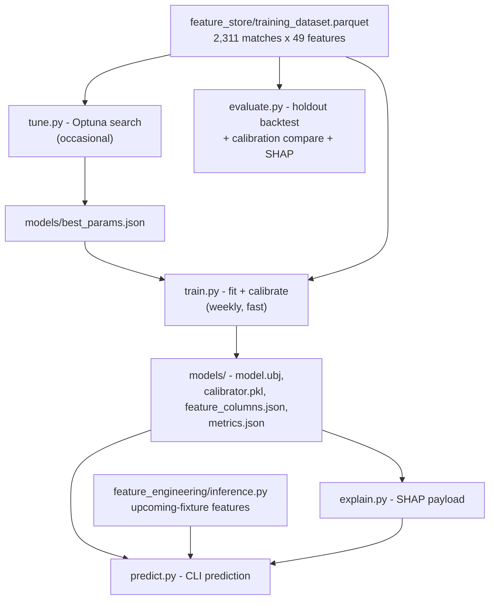

# The Mathematical Core: Model, Calibration & Explanation

How Phase 3 turns the Phase 2 training dataset into a production prediction
engine. Companion docs: [../feature_engineering/Architecture.md](../feature_engineering/Architecture.md)
(how the features are built), [../Feature_Dictionary.md](../Feature_Dictionary.md)
(what each feature means), and [Overview.md](../Overview.md) (the system rationale
and the JSON hand-off contract).

## 1. What this phase delivers

A trained, tuned, probability-calibrated XGBoost classifier plus a SHAP
explainer, exposed through a CLI that predicts genuinely future fixtures.
These are the artifacts the FastAPI endpoint (Phase 4) will serve and the
weekly ETL (Phase 4) will refresh.



## 2. The validation protocol (why results are trustworthy)

The single most important design choice is how data is split, because it
determines whether reported numbers reflect real future performance.

- **Final holdout: seasons 2025-2026 (321 matches), never touched during
  tuning or calibration.** It is used only by `evaluate.py` to report honest
  generalisation.
- **Development data: 2015-2024 (1,990 matches).** Tuning and calibration
  operate here using **expanding-window chronological folds**: train through
  season S, validate on S+1, for S+1 in {2021, 2022, 2023, 2024}. This
  mirrors production - always predicting the next season from everything
  before it - and never lets the model validate on its own past.

All of this lives in [model/__init__.py](__init__.py) (`development_split`,
`expanding_window_folds`) so tune, train, and evaluate cannot disagree about
the split.

## 3. Tuning (`tune.py`) - run occasionally

Optuna searches nine XGBoost hyperparameters (tree count, depth, learning
rate, min child weight, subsample, column subsample, L1/L2 regularisation,
gamma) using a TPE (Tree-structured Parzen Estimator) sampler. Each trial is
scored by **mean log loss across the four expanding-window folds**.

Why log loss rather than accuracy: log loss is a *proper scoring rule* that
rewards well-calibrated probabilities, and the LLM Orchestrator consumes the
probability itself, not just the binary pick. Optimising accuracy would
ignore confidence quality.

200 trials completed in ~95 seconds. The search favoured shallow trees
(`max_depth=2`, `n_estimators=250`, `learning_rate=0.017`) - the expected
outcome for a small, noisy dataset, where shallow trees resist overfitting.
Best mean cross-validated log loss: **0.607**. Winners are written to
`models/best_params.json`.

**Tune occasionally, not weekly:** the best hyperparameters reflect the
dataset's *shape* (~2,300 rows, 49 features, NRL noise), which one new round
does not change. Re-tune each off-season or after significant feature changes.

## 4. Training + calibration (`train.py`) - run weekly

Three steps:

1. **Out-of-time predictions.** Using the tuned params, generate validation
   predictions across the expanding-window folds. These are predictions on
   data the base model never trained on - the honest signal for calibration.
2. **Fit the calibrator** on those out-of-time predictions (default sigmoid;
   see below).
3. **Refit the base model on ALL matches (2015-2026)** so the served model is
   maximally informed, then save it wrapped with the calibrator.

Artifacts written to `models/`:

| File | Contents |
| --- | --- |
| `model.ubj` | XGBoost booster (native binary format) |
| `calibrator.pkl` | fitted `ProbabilityCalibrator` + method name |
| `feature_columns.json` | ordered feature list + categorical levels (`ctx_weather`) |
| `metrics.json` | training metadata + out-of-time log loss / Brier |

This is what the weekly ETL re-runs after each round; it reuses
`best_params.json` and completes in seconds.

### Why calibration matters

A model that outputs "0.70" should be right 70% of the time. Tree ensembles
are often over- or under-confident. [calibration.py](calibration.py) provides
two standard post-hoc maps, compared in `evaluate.py`:

- **sigmoid (Platt scaling):** fits a logistic curve; robust on small
  calibration sets.
- **isotonic:** free monotonic step function; more flexible but data-hungry
  and prone to overfitting ~500 calibration points.

Since calibration is *monotonic*, it changes the probability scale but not
the ranking of matches or which features drove a decision - so AUC is
identical across methods and SHAP can explain the raw margin.

## 5. Evaluation (`evaluate.py`) - the report numbers

Trains the base model on development data only (<=2024) and evaluates on the
untouched 2025-2026 holdout.

| Variant | Log loss | Brier | AUC | Accuracy |
| --- | --- | --- | --- | --- |
| Uncalibrated | 0.659 | 0.233 | 0.640 | 0.620 |
| Sigmoid | 0.661 | 0.234 | 0.640 | 0.626 |
| Isotonic | 0.674 | 0.239 | 0.632 | 0.608 |

Baselines: always-pick-home accuracy 0.558; base-rate log loss 0.687.

Reading the results:

- **AUC 0.640** on a true future holdout, matching the Phase 2 smoke-test
  reference and within the 0.60-0.67 band of published NRL/AFL models.
- **Accuracy 62.6%** vs the 55.8% always-home baseline (+6.8 points).
- **Log loss 0.661 < 0.687** base-rate baseline - the probabilities carry
  genuine information.
- **Sigmoid beats isotonic** on Brier and log loss, exactly as theory
  predicts for a small calibration set - validating sigmoid as the default.

It also writes a reliability diagram (`reports/calibration_curve.png`), a
global SHAP importance plot (`reports/shap_summary.png`), and
`reports/holdout_metrics.json`.

Global SHAP confirms the model leans on the right things: `elo_diff`,
`bt_diff`, `pythag10_diff` dominate, followed by defensive form
(`form5_points_against_diff`) and run metres - the same ordering the
Feature Dictionary's univariate analysis predicted.

## 6. Predicting future fixtures (`inference.py` + `predict.py`)

The model trains on completed matches, but a fixture we want to predict has
no result or stats yet. [feature_engineering/inference.py](../feature_engineering/inference.py)
solves this by appending a synthetic unplayed row (scores/telemetry NaN) to
the historical flat table and running the **exact same Stage 2 code paths**
used in training. Because every feature depends only on earlier matches, the
fixture - placed last in time - inherits each team's current Elo, recent
form, rest days, etc.

**Parity test (train/inference consistency).** `inference.run_parity_test`
rebuilds the feature vectors of known historical matches through the
inference path and asserts they match the stored training rows exactly. This
guards against train/serve skew, the classic production-ML failure where a
model is fed features computed differently than during training. It passes
5/5. (Achieving this surfaced and fixed a real issue - see Decisions below.)

`predict.py` loads the artifacts, builds the fixture's features, and emits
the Overview-format payload via `explain.py`: predicted outcome, calibrated
probability, and SHAP-ranked positive/negative drivers in human-readable
language.

## 7. Design decisions specific to Phase 3

| Decision | Alternative | Rationale |
| --- | --- | --- |
| Log loss as tuning objective | Accuracy / AUC | Proper scoring rule; the Orchestrator consumes probabilities, so calibration-aware optimisation matters |
| Expanding-window chronological CV | Random k-fold | Random folds leak future into past; expanding windows mirror real use |
| Tune occasionally, train weekly | Re-tune every week | Best params track dataset shape, not the latest 8 rows; saves compute and avoids instability |
| Train final model on all data; evaluate on a held-out split separately | One model for both | The served model should use all data; honest metrics need an untouched holdout. Two purposes, two fits |
| Sigmoid calibration default | Isotonic | Isotonic overfits ~500 calibration points; confirmed worse on the holdout |
| BT refit per kickoff time | BT refit per round (original) | Per-round made mid-round inference features diverge from training; per-kickoff makes train/inference identical (parity test) |
| Synthetic-row inference reusing Stage 2 | Reimplement feature math for serving | One code path cannot drift; parity test proves equality |
| `.ubj` + joblib artifacts | Pickle everything | `.ubj` is XGBoost's portable native format; safer and version-stable |

## 8. Usage

```bash
uv run python -m model.tune                 # occasional: search -> best_params.json
uv run python -m model.train                # weekly: fit + calibrate -> models/
uv run python -m model.evaluate             # holdout backtest + plots -> reports/
uv run python -m feature_engineering.inference   # parity test
uv run python -m model.predict --home Broncos --away Storm \
    --venue "Suncorp Stadium" --date 2026-07-04T09:30:00Z
```

Requires `brew install libomp` (XGBoost OpenMP runtime) on macOS.
