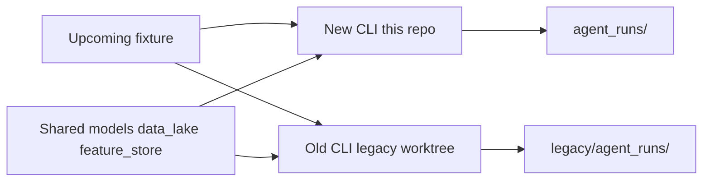

# Keep the old and new prediction systems runnable

The old system is not gone. It is commit [`dccb09c`](dccb09c) (`final predictions for round 25`, 23 Aug). The recalibration landed in [`878f4cc`](878f4cc). That first commit changed prompts, the verifier, the research filter/gate, market-price grounding, and the math “Too close” label — not a rewrite of the whole pipeline.

You already have a natural split in the data:

- **Old system:** official Rounds 23–25 in [`agent_runs/predictions_log.csv`](agent_runs/predictions_log.csv)
- **New system:** official Rounds 26–27 in the same log

Your supervisor wants both **runnable on upcoming games**. We will not try to replay R26–R27 with today’s news (that would leak). We also will not add a `--legacy` flag in the current code — that is easy to contaminate and harder to defend as “the old system.”



## Approach: git worktree at the old commit

Create a worktree at repo root so you have two full checkouts:

```bash
git worktree add legacy dccb09c
```

[`legacy/`](legacy/) is then a frozen copy of the agent as it ran R23–R25. Add `legacy/` to [`.gitignore`](.gitignore). Do not commit the worktree.

The worktree will not contain gitignored artifacts (`models/`, `data_lake/`, `feature_store/`). Point those at the current engine so both systems use the **same trained model and latest results** (fair comparison; the recalibration did not retrain XGBoost except the Too-close *label* in old `explain.py`, which stays old in the worktree):

```bash
ln -s ../../tools/mathematical_engine/models \
      legacy/tools/mathematical_engine/models
# same pattern for data_lake and feature_store
ln -s ../../agent/.env legacy/agent/.env   # if you use one
```

Then `uv sync` in `legacy/agent` (and the engine/tool packages if that checkout’s venvs are missing).

Old runs default to `legacy/agent_runs/` because that checkout’s `REPO_ROOT` is `legacy/`. New runs stay in [`agent_runs/`](agent_runs/). Two CSVs, no mixing.

## How you will run a fixture

Same rule as now: **one CLI at a time**. New first, then old (or the reverse — pick one order and keep it).

```bash
# NEW (this repo)
cd agent
uv run python -m agent_app.cli --home TEAM --away TEAM --round N --force-refresh -v

# OLD (worktree) — after the new run has fully exited
cd ../legacy/agent
uv run python -m agent_app.cli --home TEAM --away TEAM --round N --force-refresh -v
```

Each takes ~8–12 minutes. When reporting, say which tree produced the pick. Check the new run against [`docs/agent_judgement/EXPECTED_BEHAVIOUR.md`](docs/agent_judgement/EXPECTED_BEHAVIOUR.md). The old run is *not* held to that file — that file is the new logic.

## Small operator note

Add a short [`docs/agent_judgement/TWO_SYSTEMS.md`](docs/agent_judgement/TWO_SYSTEMS.md) that states:

- Old = `dccb09c` via `legacy/`
- New = current `main`
- Separate run folders
- Shared model artifacts via the three symlinks
- Do not append old-system rows into the new `predictions_log.csv`

That is enough for the supervisor write-up: you did not reconstruct the old agent from memory; you are running the exact commit that produced Rounds 23–25.
