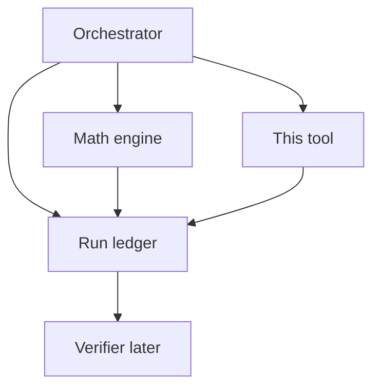

# Qualitative Research Tool — Architecture

Zero-cost, facts-only research for upcoming NRL fixtures. The Orchestrator
calls this tool for qualitative context (injuries, Late Mail, headlines);
it does **not** predict winners and does **not** use an LLM.

Companion: math engine at `../mathematical_engine/` (`POST /predict`).

## 1. Role in the system



| Concern | Owner |
| --- | --- |
| Numbers + SHAP | Mathematical engine |
| Headlines, injuries, team news | **This module** |
| Reasoning / final pick | Orchestrator (not built yet) |
| Audit / contradiction check | Verifier (reads ledger) |

## 2. Channels

| Channel | Tier | Role |
| --- | --- | --- |
| **nrl.com** topics + club hubs + article bodies | `official` / high | Primary: Late Mail, Casualty Ward, previews |
| DuckDuckGo news | `mainstream_news` | Wide discovery |
| Google News RSS | `search_discovery` | Backup wide net (no API key) |
| Reddit `r/nrl` | `unverified_community` / low | Rumour radar; must be corroborated |

Reddit items always include:

> Treat as rumour unless corroborated by official or mainstream_news items.

If Reddit returns 403/429, the channel soft-fails (`status: error` / `rate_limited`)
and the rest of the response still succeeds.

**Known limitation (not fixed yet):** In practice, Reddit has **consistently failed**
during Module 1 testing. Unauthenticated `.json` endpoints return a bot-wall
**403**; the Atom RSS fallback (`/r/nrl/new/.rss`) worked once as a probe, then
this environment started getting **429 / 403 Blocked** after repeated requests.
The channel code is kept (soft-fail) so official + DDG + Google News still run.
A reliable fix later would likely need Reddit OAuth (still free) or a different
community source (e.g. Bluesky) — not done yet.

Noise topics skipped on nrl.com: Fantasy, Tipping, Match Highlights, NRLW when
researching men’s fixtures.

## 3. Recency / this-fixture filtering

Problem: Bulldogs vs Tigers earlier in the season must not pollute this week.

Rules (`research/filter.py`):

1. Keep items published within **N days before kickoff** (default 10)
2. If title has `Round K` and request has `round_number`, drop mismatches
3. Drop clear other-fixture previews using **known NRL club nicknames** only
   (`Eels vs Panthers Preview` is kept; `Eels v Warriors` is dropped)
4. Drop Fantasy / Tipping / Highlights, historical-year noise, NRLW, NFL collisions
5. Require mention of home/away **or** league-wide Late Mail / Casualty / Team Lists
   **or** same-round league roundups (tips / teams / odds / line-ups)
6. Prefer absolute timestamps; fall back to “2 hours ago” / Yesterday; reject ISO durations (`PT4M47S`)
7. Each kept item carries `published_at`, `age_hours`, `keep_reasons`
8. Contextual cues (weather, referee, travel, form, venue, suspension, line movement)
   get a small relevance boost when kept

Article bodies are fetched **after** filtering (up to ~30 unique publisher URLs,
deduped). Extraction reads headings, paragraphs, lists, tables, and compact
widget text (team-list UIs), not only `<p>` tags, and strips Acknowledgement /
subscribe boilerplate. Google News RSS links are decoded to publisher URLs for
every kept item. Per-article soft-fail if a publisher blocks scraping.

Wide-net queries keep the proven match + injury templates, then two focused
situational queries (form/preview vs referee/conditions). Optional `venue`
adds a stadium weather/crowd query. `queries_run` is deduped in the response
(DDG and Google News share the same templates).

**Dropped-sources audit (local only):** every fresh run writes
`debug/dropped/{cache_key}.json` with the full list of filtered-out titles/URLs
and drop reasons (including `dropped_no_body` for pages that failed body
extraction). This file is **not** included in the tool response, day cache,
or anything sent to the LLM. Gitignored under `qualitative_research/debug/`.

Items without a usable `body_excerpt` are removed from the tool response after
fetching so the Orchestrator only sees evidence with actual text.

After URL resolve, items that point at the **same publisher URL** (e.g. official
nrl.com Late Mail also discovered via Google News) are collapsed to one record,
preferring `official` / `nrl_news` and richer bodies (`dropped_duplicate_url`
in the local audit).

## 4. Day cache

- Key: hash of `(home, away, kickoff_date, round_number)`
- Files under `cache/` (gitignored)
- Expires at **next Australia/Sydney calendar day**
- Same fixture same day → `cache_hit: true`, no network
- Force refresh: CLI `--force-refresh` / API `"force_refresh": true`

## 5. Response contract

See `POST /research` — full JSON including `channels`, `items`, `queries_run`,
`filter_summary`. Never truncated: the ledger needs the complete payload.

## 6. Run ledger (Orchestrator contract)

This module defines `ToolCallRecord` in `research/ledger_types.py` and can
append to a ledger via CLI `--write-ledger path`.

**Orchestrator must:**

1. Create `agent_runs/{run_id}/ledger.json` at start of each run
2. Append every tool call (math + research) with **full** request/response
3. Append agent reasoning steps and final judgement
4. Hand the ledger to the Verifier — Verifier does not re-scrape

## 7. Rate limiting

~1 req/s per host, retries with backoff, soft-fail per channel, caps on
queries/hits/article fetches. Safe for 1–3 games/day.

## 8. Usage

```bash
cd qualitative_research
uv sync

# CLI
uv run python -m research.cli \
  --home Broncos --away Storm \
  --kickoff 2026-07-25T19:30:00+10:00 --round 21

# API
uv run uvicorn api.main:app --host 127.0.0.1 --port 8001
curl -s http://127.0.0.1:8001/health
```

Interactive docs: http://127.0.0.1:8001/docs
